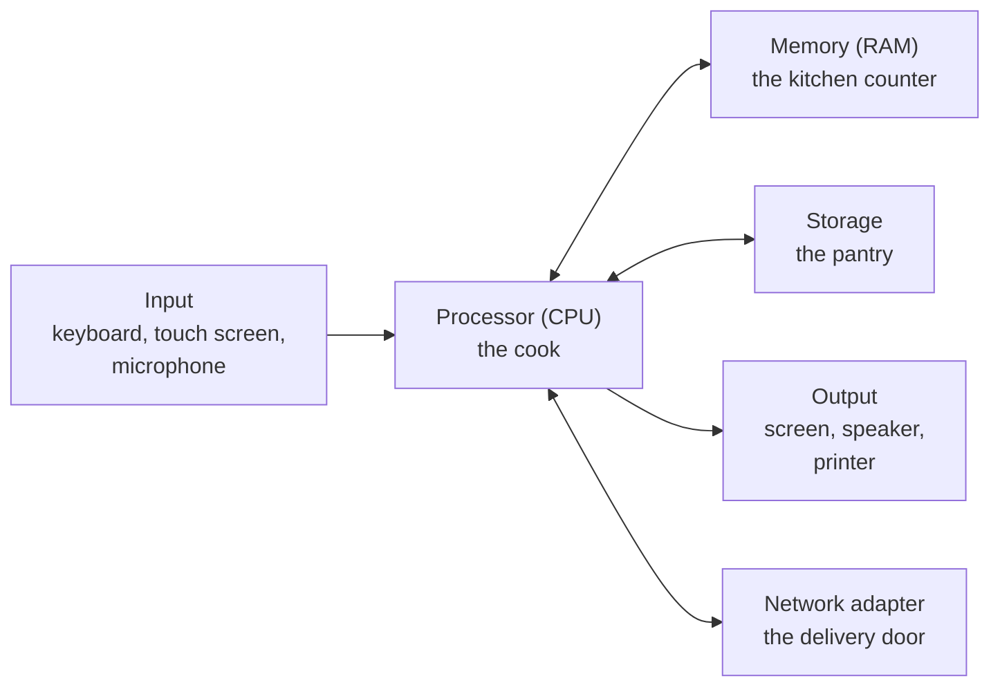
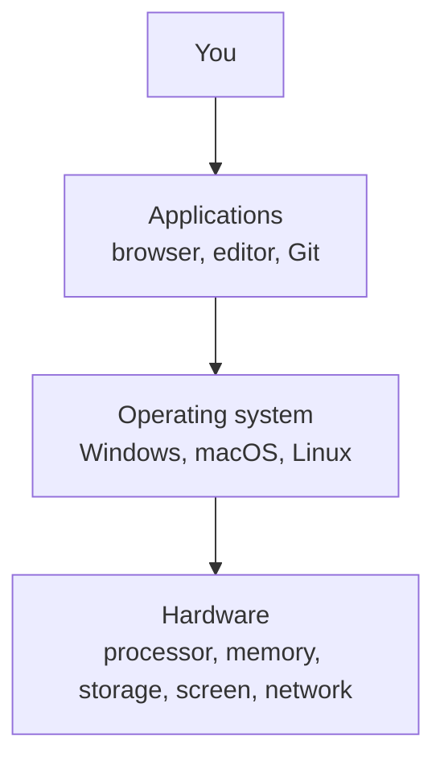

# Chapter 1 — What a Computer Is [Core]

**In this chapter**

- what a computer actually does, in one sentence you can remember
- the physical parts (hardware) and why memory and storage are different things
- the invisible layer (software), and what an operating system is for
- what "installing" a program means, and how to do it safely
- why all of this matters before we meet Git

**Before you start.** Nothing. This book assumes that you have never used a terminal, never written code and never heard the word "repository". If you already know some of this chapter, read it quickly and use the self-test at the end to check yourself.

You will not be asked to memorise anything in this chapter. You will be asked to *understand* a few ideas, because every later chapter stands on them.

---

## 1.1 A computer follows instructions

A **computer** is a machine that follows instructions. That sentence is the most important one in this chapter, so let us unpack it.

> **New term: computer.** A machine that accepts information (input), follows a list of instructions to change it (processing), keeps the results (storage), and shows them to you (output).

Everything a computer does fits that pattern.

| Stage | What happens | Everyday example |
|---|---|---|
| Input | Something goes in | You type a letter, tap a screen, or speak |
| Processing | Instructions change the information | The computer turns key presses into letters on a page |
| Storage | The result is kept | You save the page as a file |
| Output | The result comes out | The letters appear on the screen, or a printer prints them |

Your phone is a computer. So is a laptop, a cash machine, a modern car's dashboard and the box that runs the traffic lights. They look different, but each follows instructions.

**Why this matters for Git.** Git is a set of instructions (a program) that runs on a computer. It takes the files you have made as input, keeps a careful record of how they change, and shows you that record as output. If you understand what a computer does, you will always know where Git fits.

---

## 1.2 Hardware: the parts you can touch

> **New term: hardware.** The physical parts of a computer: the parts you could, in principle, drop on your foot.

Different computers have different hardware, but a few parts appear almost everywhere. To make them easy to remember, imagine a small kitchen.



*Diagram description:* a processor sits in the middle. Input devices send information to it. It exchanges information with memory (a fast, temporary workspace) and with storage (a slower, permanent place to keep things). It sends results to output devices such as a screen, and it talks to other computers through a network adapter.

| Part | What it does | In the kitchen |
|---|---|---|
| **Processor** (also called the **CPU**, "central processing unit") | Carries out instructions, one tiny step at a time, extremely fast | The cook, following a recipe |
| **Memory** (also called **RAM**, "random-access memory") | A fast workspace for whatever the computer is using right now | The counter where ingredients are laid out while cooking |
| **Storage** (a solid-state drive, hard disk, or the flash storage in a phone) | Keeps information for a long time, even when the power is off | The pantry and the fridge |
| **Input devices** | Send information in | The order slip |
| **Output devices** | Show or print results | The plate that leaves the kitchen |
| **Network adapter** | Connects to other computers (Wi-Fi or a cable) | The delivery door |

> **New term: processor (CPU).** The part of a computer that carries out instructions.
>
> **New term: memory (RAM).** Fast, temporary working space. It is emptied when the computer is switched off.
>
> **New term: storage.** Slower but permanent space that keeps information when the power is off.

### 1.2.1 The difference that will save your work: memory versus storage

Beginners often use the words "memory" and "storage" as if they meant the same thing. They do not, and confusing them causes real loss of work.

- **Memory** is the counter. It is quick, but when the power goes, it is wiped clean.
- **Storage** is the pantry. It is slower, but it keeps things.

When you type a letter in a program and have not yet saved it, the letter lives only in memory. If the battery dies, the letter is gone. When you *save*, the program copies the letter from memory into storage, and now it survives.

> **Try it.** Think of the last time you lost something you were typing. Was it saved? Was it in memory or in storage when the computer switched off?
>
> *Expected result:* you can describe the loss in terms of "it was only in memory".

**Why this matters for Git.** Saving a file to storage is the first step of keeping your work. Git goes one step further: it keeps a *history* of your saved work, so that even a mistake you saved can be undone. You will see exactly how in Part III. For now, remember the idea: saved is safer than unsaved, and *recorded in history* is safer still.

### 1.2.2 Bits and bytes, briefly

Computers store everything as numbers, and they write every number using only two symbols, 0 and 1. One of these symbols is a **bit**. A group of eight bits is a **byte**. A byte can hold one letter of ordinary English text.

> **New term: byte.** A unit of storage. One byte is eight bits. Sizes of files are counted in bytes, and in larger units built from bytes: a kilobyte is about a thousand bytes, a megabyte about a million, and a gigabyte about a billion.

You do not need to calculate with bytes. You need to know that files have sizes, that the sizes are counted in bytes, and that a photo is much bigger than a paragraph of text. In Chapter 4<!--ref:text--> you will look at real bytes and see how letters are stored.

> **Deep.** Two competing conventions exist for the larger units. Some tools count a kilobyte as 1,000 bytes; others count 1,024. When the difference matters, tools usually say which they use. It rarely matters for this book.

---

## 1.3 Software: the instructions

> **New term: software.** Instructions that tell hardware what to do. Software has no weight or shape; it is information.

The hardware alone can do nothing useful, just as a kitchen with no recipes and no cook does nothing. Software supplies the instructions. There are two kinds you must know about.

1. **Applications** (also called **programs**, **apps** or **software packages**): software that does a job for you. A web browser, a photo editor, a game and Git are all applications.
2. **The operating system**: the software that manages the computer itself and lets the applications run.

> **New term: application (program).** Software that does a specific job for a person: browsing, writing, calculating, or tracking file history.

### 1.3.1 The operating system

> **New term: operating system (OS).** The main software of a computer. It starts when the computer starts, manages the hardware, keeps track of files, and gives every application a safe place to run.

An operating system does three jobs that you will see in action again and again:

1. **It manages the hardware for everyone.** Two applications cannot both use the screen or the storage at the same instant without a referee. The operating system is the referee.
2. **It keeps the files.** It decides where information is stored and lets you find it by name.
3. **It is the translator.** An application does not talk directly to a particular brand of storage or screen. It asks the operating system, and the operating system talks to the hardware.



*Diagram description:* three layers from top to bottom. You use applications. Applications rely on the operating system. The operating system controls the hardware. Requests flow downward; results flow back up.

The translator idea explains something that will matter later. Because applications sit on top of an operating system, *the same application may have to be prepared separately for each operating system*. Git exists for several operating systems, and, importantly, the way you **start** and **use** it differs slightly between them. When it does, this book will tell you.

### 1.3.2 Windows, macOS and Linux

You will meet three families of operating system in this book. Here is what to know about each at the level you need.

| Family | Who makes it | Where you usually meet it | What to know |
|---|---|---|---|
| **Windows** | Microsoft | Many desktop and laptop computers | Uses drive letters such as `C:` and, in its traditional command tools, the backslash `\` in file locations |
| **macOS** | Apple | Apple's laptop and desktop computers | Has a single tree of folders; behaves much like Linux in the terminal |
| **Linux** | An open community; many variants | Servers, developer machines, many other devices | A *family* of systems, each variant being called a **distribution** |

> **Verification pending [R111].** Product-level statements (who makes what, and how macOS and Linux relate) are given here from general knowledge. They will be re-checked against the vendors' and the Linux community's own documentation before publication. Nothing later in this book depends on a detail of them.

You do not need to choose between them now. The book teaches on all three, with one primary environment: a program called a *terminal* running a shell named **Bash** (Chapter 7<!--ref:terminal--> explains what that means). On Windows the book uses **Git Bash**, so that all learners see the same commands.

---

## 1.4 Applications and installing

Most applications are not in your computer when you buy it. You add them. Adding an application is called **installing** it.

> **New term: installer.** A file or program whose job is to put an application in the right places on your computer and to register it with the operating system.

The usual steps are:

1. **Obtain** the installer from a source you trust.
2. **Run** the installer.
3. The installer may ask for **administrator permission**, because installing changes parts of the system that ordinary use should not change.
4. **Check** that it worked by opening the application.

> **New term: administrator.** A user account, or a temporary level of permission, that is allowed to change the computer's system settings and install software for everyone who uses it.

### 1.4.1 Package managers

Some systems also offer a **package manager**, a program that finds, installs and updates applications for you from a curated collection, so you do not have to browse websites.

> **New term: package manager.** A program that installs, updates and removes applications from a trusted collection.

For example, on Ubuntu and other Debian-family Linux systems, the package manager is called `apt`. The command that installs the shell called zsh (which the book's test environment uses) looks like this. You do not need to run it.

```bash
sudo apt-get install -y zsh
```

Other systems have their own equivalents, and Chapter 13<!--ref:install--> gives the steps for installing Git on each system and states how each set of steps was checked. The idea is the same everywhere: *ask a trusted collection for the program by name*.

### 1.4.2 Installing safely

A program you install can do anything you can do. That makes installation the most common way for harm to arrive. Build the following habits now, because Git will ask you to build the same ones about code later.

> **Security note.** Install software only from the maker's own website, from your operating system's official store or package manager, or from a source your teacher or employer names. Be suspicious of a download link in an email, a "free" copy of a paid program, or a pop-up that says your computer is infected. If you are asked for administrator permission and you did not just start an installation, refuse.

Three more habits:

- **Prefer the official source.** Search for the maker's name, then check that the address you land on belongs to them.
- **Read what you are agreeing to.** At minimum, look at *what* is being installed and *where*.
- **Keep software updated.** Updates often repair security problems. Many applications update themselves; some do not.

**When not to install.** If you only need a program once, consider whether a web version would do. Every installed program is something to keep updated and something that could be attacked.

---

## 1.5 Where Git fits

Now you have every piece you need for a first, simple picture of Git.

- Git is an **application**, that is, software.
- It runs on your **operating system**, on your **hardware**.
- It reads the **files** you have saved in **storage**, and it stores its record of their history in storage too.
- It runs only when you ask it to (you will do so through the terminal in Chapter 7<!--ref:terminal-->).

Nothing about Git is magical. It is a program that follows instructions, and its results are stored in ordinary files that you will learn to look at.

---

## Checkpoint

## What You Learned

- A computer follows instructions: input, processing, storage, output.
- Hardware is what you can touch. The processor carries out instructions, memory is fast and temporary, storage is slower and permanent.
- Saved work is in storage; unsaved work exists only in memory and disappears when the power goes.
- Software is the instructions. Applications do jobs for you; the operating system manages the computer and its files.
- Windows, macOS and Linux are three families of operating system; a program may work slightly differently on each.
- An installer puts an application on your computer; a package manager installs from a trusted collection; installing can require administrator permission.
- Install only from sources you trust.

## New Vocabulary

- **Computer**: a machine that follows instructions to accept, change, keep and show information.
- **Hardware**: the physical parts of a computer.
- **Processor (CPU)**: the part that carries out instructions.
- **Memory (RAM)**: fast, temporary working space.
- **Storage**: slower, permanent space that survives power-off.
- **Byte**: a unit of storage; eight bits.
- **Software**: instructions that tell hardware what to do.
- **Application (program)**: software that does a specific job for a person.
- **Operating system (OS)**: the main software that manages hardware and files and lets applications run.
- **Installer**: a file or program that puts an application on your computer.
- **Administrator**: an account or permission level that can change system settings and install software.
- **Package manager**: a program that installs and updates applications from a trusted collection.

## Commands Learned

None yet. (The one command shown, `sudo apt-get install -y zsh`, was an illustration of a package manager and you were not asked to run it.)

## Common Mistakes

1. **Treating "memory" and "storage" as the same thing.** Unsaved work is in memory and can be lost.
2. **Installing from the first search result or from an email link.** Go to the maker's own site or your system's official source.
3. **Clicking "Allow" on an administrator prompt out of habit.** Only allow it when you just asked for something that needs it.
4. **Assuming every operating system behaves identically.** The differences are small but real, and later chapters point them out.

## Practice

Do the exercises in [`exercises/ch01-exercises.md`](../../../exercises/ch01-exercises.md). Attempt them before opening the separate solutions file.

## Self-Test

1. In one sentence, what does a computer do?
2. You are typing a report and the power fails. Which part of the computer held your unsaved words, and why are they gone?
3. Name the three families of operating system introduced here, and say what a *distribution* is.
4. What does an operating system do that an application does not?
5. A message says "Your computer is infected! Click to install the cleaner." What are two reasons to refuse?
6. Where does Git fit in the picture from section 1.5?

## Before Moving On

You are ready for Chapter 2<!--ref:files--> if you can:

- [ ] explain the difference between memory and storage using the kitchen picture
- [ ] say what an operating system is for, without using the words "operating system" in your answer
- [ ] find out which operating system your own computer uses (look for a screen named "About" or "System information" in your settings; names vary by system)
- [ ] describe two safe habits for installing software

## How this chapter was checked

| Claim | Evidence class | Ledger |
|---|---|---|
| General account of computer parts, memory versus storage, software and operating systems | Not applicable (general computing concepts; no product-specific claim) | R110 |
| Who makes Windows, macOS and Linux distributions; how they relate | Needs re-verification against vendor and community documentation | R111 |
| `apt` is the package manager on Debian-family systems, and `sudo apt-get install -y zsh` is a valid install command | Locally tested: the command was run in the Ubuntu 24.04 test environment on 2026-09-29 | R112 |

## Where this leads

Chapter 2<!--ref:files--> explains how a computer organises its storage into **files and folders** and how to describe where a file is (its **path**). Chapter 7<!--ref:terminal--> shows you how to give commands to the computer by typing. Chapter 13<!--ref:install--> installs Git, using the ideas about installing that you met in section 1.4.
