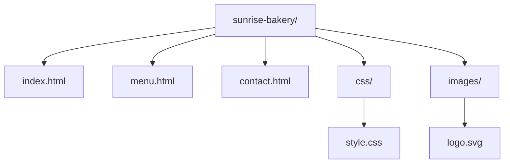
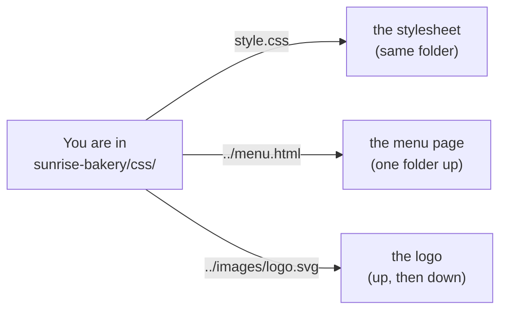

# Chapter 2 — Files, Folders and Paths [Core]

**In this chapter**

- what a file is, and how a name and an extension describe it
- how folders organise files into a tree
- how to say exactly *where* a file is (a path), in two different ways
- hidden files, and why a file called `.git` will matter soon
- copying, moving and deleting, and which of these can be undone
- permissions, at the level you need to read an error message

**Before you start.** Chapter 1<!--ref:computer-->: you know that storage keeps information when the power is off, and that the operating system looks after files.

---

## 2.1 What a file is

> **New term: file.** A named collection of information kept in storage.

A photo is a file. A letter you saved is a file. A program is a file. Even the list of names of your other files is kept in a special kind of file. Whenever you *save* something, you create or change a file.

Every file has three things you need to think about:

1. **A name**: what you call it.
2. **Contents**: the information inside it (letters, colours, sound, instructions).
3. **A place**: which folder it is in (section 2.3).

Files also carry information *about* themselves, called **metadata**: how big they are, when they were last changed, who owns them, and what the computer is allowed to do with them. You will meet metadata when you ask the computer to list files in detail.

> **New term: metadata.** Information about a file (its size, dates, owner and permissions), kept separately from what is inside the file.

### 2.1.1 Names and extensions

File names are chosen by people. Many end with a dot and a few letters: `menu.html`, `logo.svg`, `notes.txt`. That ending is the **extension**.

> **New term: extension.** The letters after the last dot in a file name (for example `.txt`). It is a *label* that suggests what kind of information is inside.

The important word is *suggests*. The extension does not change what is in the file. If you rename `holiday.jpg` to `holiday.txt`, the photo's information is unchanged; you have only changed the label, and programs that trust the label may now show nonsense.

| Extension | Usually means | Chapter where it matters |
|---|---|---|
| `.txt` | plain text | 3 and 4 |
| `.md` | text written in Markdown | 8 |
| `.html`, `.css` | the pages and appearance of a website | 3 |
| `.svg` | a picture stored as text | 3 |
| `.png`, `.jpg` | a picture stored as a compact code (binary) | 4 |
| `.docx` | a word-processor document (a packaged, non-text format) | 3 |
| `.zip` | several files compressed into one | 3 |

> **UI-VERSION NOTE.** Some systems hide extensions by default, so `menu.html` may appear as just `menu`. Look in your file manager's view or folder options for a setting named "file name extensions" (wording varies) and turn it on. You will make far fewer mistakes when you can see the full name.

**Naming habits that will help you for the rest of the book.**

- Use only lowercase letters, digits and hyphens in names you create for projects: `sunrise-bakery`, `menu.html`.
- Avoid spaces. A space is legal, but in Chapter 7<!--ref:terminal--> you will see that spaces force extra care when you type commands.
- Never use the words `final`, `new` or `latest` in a name. Chapter 9<!--ref:problem--> explains why.
- Keep the extension. It tells people, and tools, what to expect.

---

## 2.2 Folders

> **New term: folder (directory).** A container that holds files and other folders. "Directory" is the older word, still used by many tools and in this book's command chapters; it means the same thing as folder.

Folders inside folders make a **tree**. Every file lives in exactly one folder. Here is the folder tree of a small website that you will use throughout this book, a fictional business called Sunrise Bakery.



*Diagram description:* a folder called `sunrise-bakery` at the top contains three page files, `index.html`, `menu.html` and `contact.html`, and two sub-folders. The `css` folder contains `style.css`. The `images` folder contains `logo.svg`.

> **New term: root.** The top folder of a tree, from which every other folder can be reached. On macOS, Linux and Git Bash it is written `/`.

The top of a tree is called the root. The folder that contains another folder is its **parent**; the folder inside is its **child**. On your own computer there is one special folder that belongs to you, called your **home folder**: it is where your documents, downloads and settings normally live.

> **New term: home folder.** The folder that belongs to your user account on a computer, where your own files are normally kept.

### 2.2.1 Drives

Windows shows storage devices as **drives**, each with a letter: `C:` is usually the main one. macOS and Linux instead put everything into one tree that begins at a single root written `/`, and attach other storage devices as folders somewhere inside that tree.

> **Verification pending [R113].** The statements about drive letters and separators in this section are given from general knowledge and will be re-checked against Microsoft's and Apple's documentation before publication. Nothing later depends on their details, because Git Bash (Chapter 7<!--ref:terminal-->) presents the same tree-with-slashes view on every system.

---

## 2.3 Paths: saying where a file is

To open a file, the computer needs to know exactly where it is. The description of that location is a **path**.

> **New term: path.** A written description of where a file or folder is in the folder tree, listing the folders you pass through, separated by slashes.

A path is like a postal address, or a set of directions. There are two ways to give directions, and mixing them up is one of the commonest beginner errors.

### 2.3.1 Absolute paths: the full address

> **New term: absolute path.** A path that starts at the root and spells out every folder on the way, so it means the same thing wherever you are standing.

```text
/home/learner/sharif-git-lab/sunrise-bakery/menu.html
```

Read it left to right: start at the root `/`, go into `home`, then `learner`, then `sharif-git-lab`, then `sunrise-bakery`, and there is the file `menu.html`. On Windows an absolute path begins with a drive letter, for example `C:\Users\learner\sharif-git-lab\sunrise-bakery\menu.html`.

### 2.3.2 Relative paths: directions from where you are

> **New term: relative path.** A path that starts from the current directory instead of the root.

A relative path starts from *where you currently are*, which the computer calls the **current directory** (also the **working directory**).

> **New term: current directory (working directory).** The folder the computer treats as "here" when you give it a relative path.

Two short forms are worth learning now, because you will type them constantly:

| Written | Means |
|---|---|
| `.` | "this folder" |
| `..` | "the parent folder", one step up |

Suppose you are in `sunrise-bakery`. Then `css/style.css` is the relative path to the stylesheet. If you are inside the `css` folder, the same file is just `style.css`, and `../menu.html` is the menu page one step up.



*Diagram description:* standing in the `css` folder, `style.css` is in the same folder; `../menu.html` goes up one level to find the menu page; `../images/logo.svg` goes up one level and then down into `images`.

### 2.3.3 Slashes

Paths use separators between folder names. macOS, Linux and Git Bash use the **forward slash** `/`. Windows' own traditional tools use the **backslash** `\`. Everything in this book uses the forward slash, because that is what Git prints on every system, including Windows.

### 2.3.4 Home shorthand

Many systems let you write `~` (the tilde) to mean your home folder. So `~/sharif-git-lab` means "the folder `sharif-git-lab` inside my home folder". You will use `~` in Chapter 7<!--ref:terminal-->.

**Why paths matter for Git.** Git records changes to files *by their path inside your project*. It stores relative paths such as `css/style.css`, so that the project means the same thing on every computer that has a copy. When a Git message mentions `css/style.css`, you now know how to read it.

---

## 2.4 Hidden files

> **New term: hidden file.** A file that a file manager or a plain listing does not show unless you ask for it.

Systems hide files that the user normally does not need to touch, such as settings. On Linux, macOS and Git Bash, a file or folder whose name **starts with a dot** is hidden by ordinary listings. Windows uses a different mechanism, a "hidden" property, but Git Bash still shows dot-names as hidden.

You will see the effect yourself in Chapter 7<!--ref:terminal-->. For now, keep this in mind: **Git keeps its records in a hidden folder called `.git` inside your project.** The project looks the same as before; the history is in the hidden folder. Files that must not be tracked by Git are listed in a hidden text file called `.gitignore` (Chapter 18<!--ref:tracking-->).

> **Verification pending [R115].** The dot-name rule was demonstrated in this book's test environment (Chapter 7<!--ref:terminal--> transcripts); the Windows "hidden property" statement is from general knowledge and awaits documentation-level verification.

---

## 2.5 Case sensitivity

On some systems, `Report.txt` and `report.txt` are two different files. On others, they would be treated as the same name, so you could not have both in one folder.

In the book's Linux test environment, the two names were kept apart:

```text
$ touch Report.txt report.txt
$ ls
Report.txt  report.txt
```

*Example output; the same result on the tested Bash and zsh.*

Many Windows and macOS setups do not distinguish the two names by default, although they remember the capitals you typed. That difference can make a project that works on one computer fail on another, and it is a well-known source of surprise for Git users. **The safe habit: treat capitals as meaningful, and never create two names that differ only by capitalisation.**

> **Verification pending [R114].** The Linux behaviour above was tested. The Windows and macOS defaults, and how particular disks can be configured differently, are unverified.

---

## 2.6 Copying, moving, renaming, deleting

You can do four things to a file. Only some can be undone.

| Action | What it does | Can you undo it? |
|---|---|---|
| **Copy** | Makes a second, identical file | Yes: delete the copy |
| **Move** | Puts the file in another folder | Yes: move it back |
| **Rename** | Changes the name (a move within the same folder) | Yes: rename it back |
| **Delete** | Removes the file | **Sometimes**, and only if you notice in time |

Deleting deserves care. Many graphical systems have a recycle bin or trash: a deleted file is parked there and can be restored. The command line has **no** trash: a file deleted from the terminal is gone. In Chapter 7<!--ref:terminal--> you will practise deleting *only* files you have just created, in a safe practice folder.

> **⚠️ CAUTION.** Deleting is the one everyday action with no guaranteed undo. Even the recycle bin empties, and some kinds of storage (a memory stick, a network drive) bypass it. Chapter 25<!--ref:undo--> will show how Git turns "delete" into something you *can* undo, for files that have been committed to history.

---

## 2.7 Permissions, gently

Files carry **permissions**: rules about who may do what with them.

> **New term: permission.** A rule that says which user may read, change or run a particular file or folder.

Three kinds of action are controlled:

- **Read**: look at the contents.
- **Write**: change or delete the contents.
- **Execute**: run the file as a program (or, for a folder, enter it).

On Linux, macOS and Git Bash these are shown as a string of ten characters when you list a file in detail. Here is a real example from the test environment. First the file has private permissions, then normal ones:

```text
$ chmod 600 plan.txt
$ ls -l plan.txt
-rw------- 1 learner learner 0 <date> plan.txt
$ chmod 644 plan.txt
$ ls -l plan.txt
-rw-r--r-- 1 learner learner 0 <date> plan.txt
```

*Example output. The `<date>` stands for the date and time your computer prints, and `learner` for the owner's name.*

You do not need to decode the string now. What you need: the letters `r`, `w` and `x` mean read, write and execute, and the dashes mean "not allowed". **A "Permission denied" message means the operating system refused an action because of these rules.** Chapter 7<!--ref:terminal--> shows how to read that message, and Chapter 38<!--ref:ghauth--> shows a case where a file *must* have restrictive permissions for security: a private key.

Permissions also explain why **administrator** permission (Chapter 1<!--ref:computer-->) exists: some files belong to the system, and only an administrator may change them.

---

## 2.8 Putting it together: a project folder

A **project folder** is simply a folder that holds everything that belongs to one piece of work. All the files of the Sunrise Bakery website live in one folder called `sunrise-bakery`. Git will treat *that folder* as the unit it tracks, so it pays to keep one project per folder, with a clear name and a tidy inside.

> **Try it.** Using your graphical file manager, create a folder in your home folder called `sharif-git-lab`. Inside it, create a folder called `sunrise-bakery`. Then create inside `sunrise-bakery` two folders called `css` and `images`.
>
> *Expected result:* a three-level tree: `sharif-git-lab` contains `sunrise-bakery`, which contains `css` and `images`. Chapter 7<!--ref:terminal--> will build the same structure again with commands, and you can compare.

**When not to use a folder tree.** A tree fits most projects. If files need to belong to several groups at once (a photo that is in both "holiday" and "family"), a tree is awkward, and applications that use tags or albums are better. Git uses a tree because source projects are naturally trees.

---

## Checkpoint

## What You Learned

- A file is a named collection of information in storage, with metadata about itself.
- The extension is a label that suggests the kind of contents; it does not change the contents.
- Folders hold files and other folders, forming a tree with a root; you have a home folder.
- A path says where a file is. An absolute path starts at the root; a relative path starts at the current directory. `.` means this folder and `..` means the parent folder.
- Dot-names are hidden on Linux, macOS and Git Bash; Git keeps its records in a hidden `.git` folder.
- Capitalisation can matter; never rely on two names that differ only in capitals.
- Copy, move and rename are reversible; delete may not be.
- Permissions control read, write and execute; "Permission denied" means a rule was applied.

## New Vocabulary

- **File**: a named collection of information kept in storage.
- **Metadata**: information about a file, such as size, dates, owner and permissions.
- **Extension**: the letters after the last dot in a file name; a label for the kind of contents.
- **Folder (directory)**: a container for files and other folders.
- **Home folder**: the folder that belongs to your user account.
- **Root**: the top folder of a tree, written `/` on macOS, Linux and Git Bash.
- **Path**: a written description of where a file or folder is in the tree.
- **Absolute path**: a path that starts at the root.
- **Relative path**: a path that starts at the current directory.
- **Current directory (working directory)**: the folder that counts as "here" for relative paths.
- **Hidden file**: a file not shown by ordinary listings unless requested.
- **Permission**: a rule about who may read, change or run a file.

## Commands Learned

None yet. (Section 2.5 and section 2.7 quote real command output so that you can recognise it later; you were not asked to type commands.)

## Common Mistakes

1. **Believing that renaming the extension converts the file.** It only changes the label.
2. **Mixing up absolute and relative paths.** If a relative path "does not work", first check where you are.
3. **Using spaces and capitals freely in project names.** Prefer lowercase with hyphens.
4. **Assuming the recycle bin exists everywhere.** The command line, memory sticks and network drives may bypass it.
5. **Creating two names that differ only in capitals.** They may collide on another computer.

## Practice

Do the exercises in [`exercises/ch02-exercises.md`](../../../exercises/ch02-exercises.md).

## Self-Test

1. What is the difference between a file's name and its contents?
2. You are inside `sunrise-bakery/css`. Write the relative path to `logo.svg` in `sunrise-bakery/images`.
3. Write the absolute path of `menu.html` for the tree in section 2.2 if `sunrise-bakery` is in `/home/learner/sharif-git-lab`.
4. What does `..` mean? What does `.` mean?
5. Why might a file be invisible in a folder that clearly contains it?
6. What does "Permission denied" tell you?

## Before Moving On

You are ready for Chapter 3<!--ref:editors--> if you can:

- [ ] draw the Sunrise Bakery folder tree from memory
- [ ] turn on the display of file extensions on your computer
- [ ] explain the difference between absolute and relative paths with one example each
- [ ] say why deleting is the only action in section 2.6 with no guaranteed undo

## How this chapter was checked

| Claim | Evidence class | Ledger |
|---|---|---|
| Drive letters and separators on Windows versus macOS/Linux | Needs re-verification | R113 |
| File names differing by case are distinct on the tested Linux system; Windows/macOS defaults | Linux: locally tested (`verification/ch02-files`, bash and zsh); Windows/macOS: unverified | R114 |
| Dot-names are hidden from plain `ls`, shown by `ls -a`; Windows hidden attribute | Unix-like: locally tested; Windows: unverified | R115 |
| `ls -l` mode strings after `chmod 600` and `chmod 644` | Locally tested (bash 5.2 and zsh 5.9, GNU coreutils) | R116 |

## Where this leads

Chapter 3<!--ref:editors--> looks at the *contents* of files that are made of text, and at the programs (editors) used to change them. Chapter 4<!--ref:text--> looks inside text files at the level of bytes. Chapter 7<!--ref:terminal--> gives you a way to create, list, copy and delete files by typing, using every path idea from this chapter.
