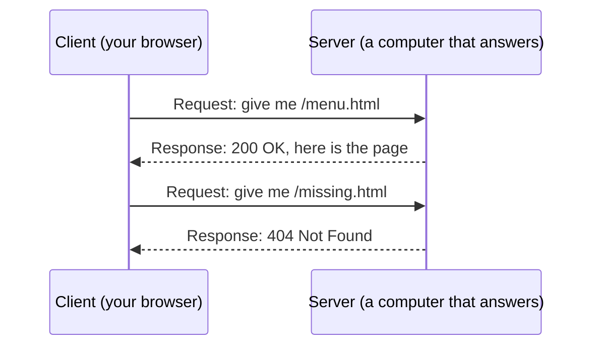

# Chapter 5 — The Internet, the Web and Servers [Core]

**In this chapter**

- what a network and the internet are, and how the web differs from the internet
- how to read a web address (URL) piece by piece
- what "client" and "server" mean, shown with a real request and reply
- what "local" and "remote" mean, and why Git needs both ideas
- what the "S" in HTTPS does and does not promise

**Before you start.** Chapter 1<!--ref:computer-->: you know what hardware, software, applications and an operating system are.

> **Look, don't type.** As in Chapter 4<!--ref:text-->, some boxes show commands on lines that begin with `$`, followed by real recorded output. You are not asked to type them; Chapter 7<!--ref:terminal--> introduces the terminal.

---

## 5.1 Networks, the internet, and the web

> **New term: network.** Two or more computers connected so that they can exchange information.

Your phone and your home router form a small network. Your school's computers form a bigger one. The **internet** is what you get when networks all over the world are connected to one another.

> **New term: internet.** The worldwide system of connected networks, which lets any connected computer exchange information with any other.

Picture the road system of a country: village lanes, town streets and motorways, all joined so that a lorry can drive from anywhere to anywhere. No single company owns all the roads, and the roads carry many kinds of traffic. The internet is the roads.

### 5.1.1 The web is one thing that travels on the internet

Beginners often say "internet" when they mean "the web". They are different.

> **New term: web (World Wide Web).** A system of linked pages and applications that you view with a browser, using the internet to fetch them.

Email, video calls, online games and file downloads also travel over the internet, but they are not the web. **Git and GitHub also use the internet.** Git can copy a project to and from a computer in another city, and GitHub is a service, reached through the web, built around such copies. You will see how in Part V.

| | Internet | Web |
|---|---|---|
| What it is | The connected networks | A service that runs on those networks |
| Analogy | The roads | One kind of delivery that uses the roads |
| Needs a browser | No | Yes, normally |
| Other examples on the same roads | Email, video calls, Git | (this is one of them) |

> **New term: browser.** An application for viewing web pages and web applications.

---

## 5.2 Reading a web address

Every page on the web has an address called a **URL** (uniform resource locator).

> **New term: URL.** The written address of a resource on the internet, made of several parts such as the scheme, the host and the path.

Here is a made-up address, split into its parts by a program, so that you can see the pieces:

```text
URL:      https://example.org:8443/menu/cakes?sort=price&page=2#top
scheme:   https
host:     example.org
port:     8443
path:     /menu/cakes
query:    sort=price&page=2   -> {'sort': ['price'], 'page': ['2']}
fragment: top
```

*Example output from `verification/ch05-internet/url_parts.py`, which uses Python's standard library to split the address. You do not need to run it.*

| Part | In the example | Meaning |
|---|---|---|
| **Scheme** | `https` | How to talk to the server (here: secure web traffic) |
| **Host** | `example.org` | Which computer to talk to |
| **Port** | `8443` | Which "door" on that computer (usually omitted: the scheme implies a default) |
| **Path** | `/menu/cakes` | Which resource on that computer |
| **Query** | `sort=price&page=2` | Extra details you send, as name=value pairs |
| **Fragment** | `top` | A spot inside the page; it stays in your browser |

The **path** here looks like a folder path (Chapter 2<!--ref:files-->), and often it maps onto one. That is a habit, not a rule.

**Domain names.** The host part is usually a **domain name**, a human-friendly name such as `example.org`.

> **New term: domain name.** A human-friendly name, such as `example.org`, that identifies a host on the internet.

The names `example.org` and `example.com` are reserved for use in documentation, so this book uses them and they will never belong to a real business. (This is a well-known convention; the standards that define it have not yet been consulted, see the ledger entry below.)

> **Verification pending [R122].** That `example.org` is reserved for examples comes from general knowledge and awaits confirmation from the standards documents.

### 5.2.1 How a name finds a computer

Computers on the internet find each other by numbers called **IP addresses**. People prefer names, so the internet has a service, the **domain name system (DNS)**, that works like a phone book: you give it a name and it gives back the number.

> **New term: IP address.** A number that identifies a computer on a network, so that other computers can send information to it.
>
> **New term: DNS (domain name system).** The internet's "phone book": a service that turns domain names into IP addresses.

You will rarely need to think about DNS, but you will meet it when you connect your own domain name to a website (Chapter 69<!--ref:pages-->).

---

## 5.3 Client and server

Almost everything on the internet has two sides.

> **New term: client.** The computer or program that asks for something.
>
> **New term: server.** A computer (or program) whose job is to answer requests. It waits until a client asks.

Use a restaurant as the picture. You (the client) look at the menu and place an order; the kitchen (the server) prepares it and sends it out. Your browser is a client: it *requests* a page. A web server *responds* with the page.



*Diagram description:* two participants. The client asks the server for `/menu.html`; the server replies "200 OK" with the page. The client then asks for `/missing.html`; the server replies "404 Not Found".

A "server" is not a special kind of machine. It is a role: any computer running a program that answers requests is acting as a server. To prove it, the recording below runs *both sides on one computer*. A small web server (a program included with the language Python) serves a folder that holds one page, and a client program called `curl` requests pages from it.

```text
$ curl -i http://127.0.0.1:8765/index.html
HTTP/1.0 200 OK
Content-type: text/html
Content-Length: 24

<h1>Sunrise Bakery</h1>
$ curl -i http://127.0.0.1:8765/missing.html
HTTP/1.0 404 File not found
```

*Example output, recorded by `verification/ch05-internet/local_server_demo.sh`. The address `127.0.0.1` means "this same computer" (section 5.4). Header spelling and the protocol version can differ between versions of the tools.*

Read it as a conversation:

1. The client asked for `/index.html`. The first line of the reply is the **status line**: `200 OK`. 200 is the code for "success".
2. Then come a few **headers** (details about the reply: the type of content and its length: 24 bytes), a blank line, and the **body**: the page itself.
3. The client asked for a page that does not exist. The status line says `404`: "not found".

> **New term: HTTP.** The set of rules (protocol) that web clients and servers follow to exchange requests and responses.

You have now seen the two codes you will meet most: **200** (success) and **404** (not found). Many other status codes exist. When GitHub or a tool reports one, you can look it up.

> **Verification pending [R121].** The demonstration ran on a real server and client and shows the behaviour of that pair. The statement that this *is* HTTP, and the meaning of status codes, come from general knowledge and are yet to be checked against the official standard.

---

## 5.4 Local and remote

> **New term: local.** On the computer you are using now.
>
> **New term: remote.** On a different computer, reached over a network.

`127.0.0.1` and the name `localhost` both mean "this very computer". A file in your `sharif-git-lab` folder is local. A page on `example.org` is remote.

Two consequences matter for everything that follows:

- **Local is fast, private and works with no connection.** Remote needs the network and depends on someone else's computer being on.
- **A copy is not the original.** If a project exists on your laptop and on a server, they are two separate copies that can differ.

**This is the heart of Git and GitHub.** Git keeps the complete history of your project **locally**, on your own computer, so most of your work needs no internet at all. GitHub is a **remote** place where a copy of that history is stored so that other people (and other computers of yours) can reach it. Git's commands for moving history between local and remote (Chapter 23<!--ref:remotes-->) will make sense because you already know both words.

**"The cloud."** People say "in the cloud" to mean "on someone else's servers, reached over the internet". There is nothing airy about it: it is computers in buildings.

---

## 5.5 Website or web application?

A **website** is a collection of pages that mostly show information. The Sunrise Bakery site is one. Its pages are **static**: every visitor gets the same files, exactly as saved.

A **web application** does work as you use it: it remembers who you are, lets you change things, and builds each page for you from stored data. Online banking, email and GitHub itself are web applications.

| | Website (static) | Web application |
|---|---|---|
| Pages | The same files for everyone | Built for you as you use it |
| Needs a program running on the server | No, only files | Yes |
| Example | The bakery's menu | GitHub |

GitHub Pages (Chapter 69<!--ref:pages-->) can host static websites like the bakery's. Web applications need more.

---

## 5.6 What the "S" in HTTPS means

You will see addresses that begin `https://`. The **S** stands for **secure**.

> **New term: HTTPS.** HTTP with encryption. The traffic between your browser and the server is scrambled so that others on the network cannot read it, and the server has to prove its identity with a certificate.

What HTTPS promises:

1. **Privacy in transit.** People between you and the server cannot read or change what you send.
2. **Identity.** You are talking to the server that owns that name, not to an impostor sitting in the middle.

What HTTPS does **not** promise:

- It does not mean the website is honest or safe. A criminal can also have a genuine certificate for a lookalike name.
- It does not protect you *after* the information arrives: whoever runs the server can still see what you send.

> **Security note.** A padlock or "secure" label in the address bar means the connection is encrypted. It does not mean the site is trustworthy. Check the *name* in the address, and be wary of names that are almost, but not quite, the name you expect.

> **Verification pending [R123].** This description is a general account of HTTPS. It is not yet checked against the standard or a browser vendor's documentation.

**Why it matters for Git.** When Git talks to GitHub over the web, it can use HTTPS. In Chapter 38<!--ref:ghauth--> you will choose between that and another method, SSH (introduced in Chapter 6<!--ref:accounts-->).

---

## 5.7 Publishing and privacy

Anything you put on a server that other people can reach can be copied by them. Before you publish, ask three questions:

1. **Who can reach it?** Public means anyone.
2. **What is in it?** Passwords, keys and personal information must never be in a project that others can read. Chapter 33<!--ref:gitsec--> returns to this at length, because Git *remembers* everything that is committed, even after you delete it.
3. **Could I undo it?** Once a copy has left your computer, treat it as permanently out.

---

## 5.8 Optional [Deep]: run both sides yourself

> **Deep.** If you have Python installed, you can repeat the recording of section 5.3 after Chapter 7<!--ref:terminal-->. In a terminal, change into a folder that contains an `index.html`, and run `python3 -m http.server 8765 --bind 127.0.0.1`. That starts a web server on your own computer. Open `http://127.0.0.1:8765/index.html` in your browser: you are now both client and server. Stop the server with Ctrl+C. Nothing here is needed later in the book.

---

## Checkpoint

## What You Learned

- A network connects computers; the internet connects networks; the web is one service that uses the internet.
- A URL has parts: scheme, host, port, path, query and fragment.
- A domain name is turned into an IP address by DNS.
- A client asks and a server answers; "server" names a role, not a special machine.
- HTTP responses carry a status code (200 success, 404 not found), headers and a body.
- Local means on your computer; remote means on another. Git keeps history locally and can copy it to remote places such as GitHub.
- HTTPS encrypts traffic and verifies the server's identity; it does not certify honesty.
- Assume anything published may be copied.

## New Vocabulary

- **Network**: computers connected so that they can exchange information.
- **Internet**: the worldwide system of connected networks.
- **Web (World Wide Web)**: linked pages and applications viewed with a browser.
- **Browser**: an application for viewing web pages.
- **URL**: the written address of a resource, made of scheme, host, path and other parts.
- **Domain name**: a human-friendly name that identifies a host, such as `example.org`.
- **IP address**: a number that identifies a computer on a network.
- **DNS (domain name system)**: the service that turns domain names into IP addresses.
- **Client**: the computer or program that asks.
- **Server**: the computer or program that answers.
- **HTTP**: the rules web clients and servers use to exchange requests and responses.
- **HTTPS**: HTTP with encryption and server identity checks.
- **Local**: on the computer you are using.
- **Remote**: on a different computer, reached over a network.

## Commands Learned

None to type yet. You *read* the output of `curl -i` requests to a local server.

## Common Mistakes

1. **Saying "internet" when you mean "web".** Email, Git and games use the internet too.
2. **Believing a padlock means a site is safe.** It means the connection is encrypted.
3. **Forgetting that a copy on a server is not the same as the file on your laptop.** They can differ.
4. **Treating "server" as a special machine.** Any computer can play the role.
5. **Publishing something private "for a moment".** It may be copied at once.

## Practice

Do the exercises in [`exercises/ch05-exercises.md`](../../../exercises/ch05-exercises.md).

## Self-Test

1. What is the difference between the internet and the web?
2. Split `https://example.org/menu/cakes?sort=price#top` into scheme, host, path, query and fragment.
3. Who is the client and who is the server when you open a page in a browser?
4. What does status code 404 mean?
5. Give one thing HTTPS promises and one thing it does not.
6. Which is *local*: a file in your `sharif-git-lab`, or a page on `example.org`?

## Before Moving On

You are ready for Chapter 6<!--ref:accounts--> if you can:

- [ ] read a URL and name its parts
- [ ] describe the client/server conversation in your own words
- [ ] explain "local" and "remote" using an example from your own work
- [ ] say what HTTPS does not promise

## How this chapter was checked

| Claim | Evidence class | Ledger |
|---|---|---|
| A URL splits into scheme, host, port, path, query and fragment as shown | Locally tested (`url_parts.py`, re-run in CI); RFC 3986 not consulted | R120 |
| A client/server exchange returns 200 with headers and body for an existing page and 404 for a missing one | Locally tested (`local_server_demo.sh`, re-run in CI); HTTP standard not consulted | R121 |
| `example.org` is reserved for documentation | Needs re-verification | R122 |
| What HTTPS does and does not promise | Needs re-verification | R123 |

## Where this leads

Chapter 6<!--ref:accounts--> explains how a server knows *who you are* and what you may do, an essential idea before Git connects to GitHub. Chapter 23<!--ref:remotes--> uses "local" and "remote" precisely, and Part V introduces GitHub as a remote service.
