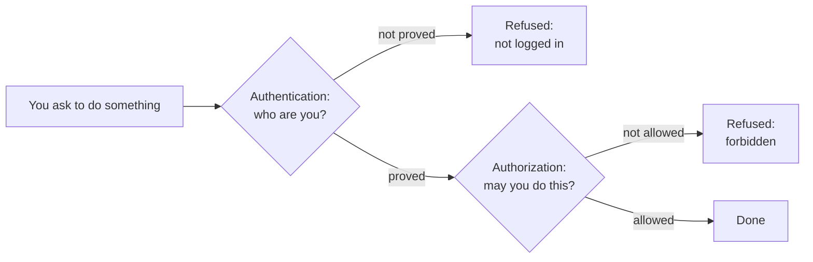
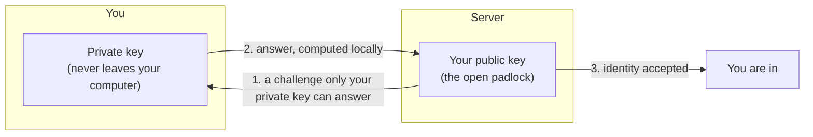

# Chapter 6 — Accounts, Passwords and Trust [Core]

**In this chapter**

- what an account is, and how a service knows who you are
- why passwords fail, and what to do instead
- the difference between proving who you are (authentication) and being allowed to act (authorization)
- what a token and a key pair are, in plain language
- what SSH is, at the level you need before Git uses it
- how to recognise a phishing attempt and recover from a lost account

**Before you start.** Chapter 5<!--ref:internet-->: you know that a server answers requests from clients, and that HTTPS encrypts the connection but does not prove that a site is honest.

This chapter has no commands. It teaches the ideas that GitHub will ask you to use in Chapter 38<!--ref:ghauth-->, and that Chapter 33<!--ref:gitsec--> will need when it talks about leaked secrets. Read it slowly: security ideas are much easier to learn now than after something has gone wrong.

---

## 6.1 Accounts

Chapter 5<!--ref:internet--> showed that a server answers requests from anyone who asks. That is fine for a public menu. It is not fine for your bank, your email or your projects. Those services need to know **who is asking**, and what that person is allowed to do.

> **New term: account.** A record kept by a service that represents you: your identity, your settings and your permissions.

> **New term: username.** The name that identifies your account on a service. It is usually public.

Your **username** and your **display name** are different things. The username is a unique label (`sharif-example`); the display name is the friendly name shown next to your posts. Choose your username carefully for anything professional, because on some services it appears in every web address that belongs to you, and changing it later can break links. (Chapter 37<!--ref:ghaccount--> returns to this for GitHub.)

An account is the first of two ideas you will use constantly. The second is what the service does when you try to *use* it: it asks you to prove that you are the owner.

---

## 6.2 Passwords, and why they fail

> **New term: password.** A secret string of characters that you present to prove that you own an account.

A password is *something you know*. It is simple, and simple is why it is so often misused. Passwords fail in five common ways:

| Failure | What happens |
|---|---|
| **Guessing** | Short or common passwords are found quickly by trying likely words |
| **Reuse** | The same password on many services: one leak opens all of them |
| **Phishing** | A fake site or message tricks you into typing your password to a criminal |
| **Leaks** | A service is broken into and its stored passwords are stolen |
| **Sharing** | You give your password to someone, who gives it to someone else |

The habits that defeat most of these are simple:

1. **Use a different password for every service.** Then a leak on one does not spill onto the others.
2. **Make each password long and unpredictable.** Length matters more than clever symbols. A few unrelated words strung together (a *passphrase*) can be long and still memorable.
3. **Let a tool remember them.** No person can memorise dozens of long, unique passwords.

> **New term: password manager.** An application that stores all of your passwords in an encrypted store, protected by one strong password, and fills them in for you.

A password manager turns the impossible task of remembering many secrets into the manageable task of remembering one. Choose one from a maker you can verify, and protect its master password very carefully.

> **Security note.** Never store passwords in a plain text file, a spreadsheet, a note on your phone, or in a project that you keep with Git. In Chapter 33<!--ref:gitsec--> you will see why files committed to Git can never be considered truly deleted.

---

## 6.3 More than one proof: two-factor authentication

A password can be stolen. So services let you add a **second proof**, taken from a different family. There are three families of proof:

| Family | Meaning | Example |
|---|---|---|
| **Something you know** | A secret in your head | A password or PIN |
| **Something you have** | An object that only you hold | A phone that shows a code, or a physical security key |
| **Something you are** | A body feature | A fingerprint or face scan |

> **New term: two-factor authentication (2FA).** Proving who you are with two proofs from different families, for example a password and a code from your phone.

With 2FA, a thief who steals your password still cannot get in, because they do not hold your phone. The extra step is a small nuisance that removes a very large risk.

Second factors are not all equally strong. General security guidance ranks a physical security key or an app-generated code above a code sent by text message, because text messages can be intercepted or redirected in ways that a key in your pocket cannot. Use the strongest second factor that the service offers and that you can manage.

> **Verification pending [R124].** The ranking of second factors and the recommendations in this chapter are general security guidance. They will be checked against the published guidance of a standards body and the services' own documentation before release. No statement about a particular service (for example, whether GitHub requires 2FA) is made here.

### 6.3.1 Recovery: plan for losing the second factor

Every 2FA system needs a way back in if you lose the phone. Services normally provide **recovery codes**, one-time codes to be stored safely *before* you need them. Print them or keep them in your password manager, and keep them away from your phone. Add a backup email address or a second key where the service allows.

Set up recovery **on the day you switch 2FA on**. Recovering an account without preparation can be slow or impossible, because a service that can let you in without proof could let an attacker in too.

---

## 6.4 Authentication and authorization

Two words sound alike, and beginners mix them up. Learn them as a pair.

> **New term: authentication.** Proving *who you are*.
>
> **New term: authorization.** Deciding *what you are allowed to do* once your identity is known.

The picture that helps is a hotel.

- At reception you show your passport and booking: **authentication**. The hotel now knows you are the guest in room 12.
- The key card you receive opens room 12, the gym and the front door, but **not** room 13 or the manager's office: **authorization**.

*Diagram description:* a request first meets an identity check. If your identity is not proved, the request is refused as "not logged in". If it is proved, a second check asks whether you may do this particular thing. If not, the request is refused as "forbidden". If yes, it is carried out.

The two failures feel different and have different cures. "I cannot log in" is an authentication problem: check the password, the second factor and the account name. "I am logged in but it says I do not have permission" is an authorization problem: nothing is wrong with your identity; you need someone to grant you access. In Chapter 38<!--ref:ghauth--> and Chapter 49<!--ref:collab--> you will meet both problems on GitHub.

---

## 6.5 Least privilege

> **New term: least privilege.** Giving each person or program only the access it needs to do its job, and no more.

You would not give a new employee the keys to every room in the building. In the same way, do not give a tool or person more access than they need, and remove access when it is no longer needed. Least privilege limits the damage when something goes wrong: a stolen key that can only open one door is far less dangerous than a stolen master key. You will use this principle throughout the book, especially for tokens and automation.

---

## 6.6 Tokens: a limited stand-in for a password

Sometimes a *program*, not a person, has to act on your behalf: a script, or a tool such as Git. You do not want to hand a program your password, which opens everything and never expires.

> **New term: token.** A secret string that stands in for a password, usually with limited permissions and, often, an expiry date.

A token is like a temporary visitor pass instead of your house key. It can be limited to certain rooms and cancelled without changing the locks. When we come to GitHub (Chapter 38<!--ref:ghauth-->), you will meet tokens that are made to be used by tools.

A token is **still a secret**. Whoever holds it can do what it allows. Treat it like a password: never post it, never commit it into a project, and cancel it at once if you suspect it has leaked.

---

## 6.7 Keys: proving identity without sending a secret

A password has a weakness: to prove that you know it, you *send* it to the other side. If someone is listening, or if the other side is dishonest, the secret is out.

There is a cleverer arrangement, used for the login method called **SSH** and for signing your work. It uses a **key pair**: two linked keys, made together.

> **New term: key pair.** Two mathematically linked keys, a public key and a private key, created together. Something locked with one can be unlocked only with the other.

- The **public key** can be shared with anyone. Think of it as an open padlock. You hand copies to everyone.
- The **private key** stays on your computer and is never shared. Think of it as the only key that opens that padlock.

To prove who you are, you do not send the private key. The server, which holds your open padlock (public key), can set a puzzle that only the private key can solve. You solve it on your own computer and return the answer. The server is satisfied, and the private key never left your machine.

*Diagram description:* the server holds your public key. It sends a challenge. Your private key, which stays on your computer, computes the answer and sends only the answer back. The server checks the answer against your public key and accepts you.

> **New term: SSH (Secure Shell).** A method of connecting securely to another computer over a network. It can use a key pair to prove who you are, so no password is sent.

> **⚠️ CAUTION.** Sharing the **public** key is safe and normal. Sharing the **private** key is like handing out your master key. If a private key is ever posted, committed to a project or emailed, treat it as stolen: cancel it and make a new pair. Nothing in this book will ever ask you to reveal a private key.

You will generate your first key pair in Chapter 38<!--ref:ghauth-->, with the exact steps and checks, and you will learn why a private key file must have restrictive permissions (Chapter 2<!--ref:files-->).

---

## 6.8 Recognising phishing

> **New term: phishing.** Tricking someone into giving away a secret or doing something harmful by pretending to be a trusted person or service.

Phishing does not break the computer; it breaks the person. Typical signs:

1. **Urgency or fear.** "Your account will be closed in one hour."
2. **A link that is *almost* right.** `sunrise-bakery-login.example.net` is not `sunrise-bakery.example.org`. Look at the host part of the address (Chapter 5<!--ref:internet-->).
3. **A request for a secret.** No real service will ask for your password, code or private key by email or message.
4. **A surprise.** An attachment or invoice that you were not expecting.

Here is an invented, fictional message. Read it as a detective.

> *Subject: URGENT security notice*
> *Dear customer, unusual activity was detected. Log in within one hour at https://sunrise-bakery-login.example.net/verify or your account will be deleted. Reply with your password to confirm.*

At least four warning signs are present: urgency; a threat; a link on an unexpected domain; and a request for a password by reply. **Do not click.** Open the service by typing its real address yourself, or use a bookmark, and look there for any genuine notice.

If you *have* entered a password on a suspicious page: change it at once on the real site, change it anywhere else you used it (another reason not to reuse passwords), check the account's recent activity, and turn on 2FA if it is not already on.

---

## 6.9 What this means for Git and GitHub

Every idea in this chapter returns:

| Idea | Where it returns |
|---|---|
| Account, username | Chapter 37<!--ref:ghaccount--> |
| Password, 2FA, recovery | Chapter 38<!--ref:ghauth--> |
| Authentication versus authorization | Chapter 49<!--ref:collab--> and Chapter 50<!--ref:protect--> |
| Token | Chapter 38<!--ref:ghauth--> and Chapter 60<!--ref:wfsec--> |
| Key pair and SSH | Chapter 38<!--ref:ghauth--> |
| Least privilege | Chapter 63<!--ref:secpractice--> |
| Leaked secrets | Chapter 33<!--ref:gitsec--> |

You do not need to remember these now. You need to remember the *shape* of the ideas, so that when GitHub asks you to make a token or a key, it does not feel like magic.

---

## Checkpoint

## What You Learned

- An account represents you on a service; a username identifies it.
- Passwords fail through guessing, reuse, phishing, leaks and sharing. Use unique, long passwords kept in a password manager.
- Two-factor authentication adds a second proof from a different family; plan recovery when you switch it on.
- Authentication proves who you are; authorization decides what you may do. They fail differently.
- Least privilege means giving only the access that is needed.
- A token is a limited stand-in for a password and is still a secret.
- A key pair has a shareable public key and a private key that never leaves your computer; SSH can use one to prove your identity without sending a secret.
- Phishing tricks people; look for urgency, odd domains and requests for secrets.

## New Vocabulary

- **Account**: a record a service keeps to represent you.
- **Username**: the name that identifies your account.
- **Password**: a secret string that proves you own an account.
- **Password manager**: an application that stores your passwords securely.
- **Two-factor authentication (2FA)**: proving who you are with two proofs from different families.
- **Authentication**: proving who you are.
- **Authorization**: deciding what you are allowed to do.
- **Least privilege**: giving only the access that is needed.
- **Token**: a limited stand-in for a password.
- **Key pair**: a linked public key and private key.
- **SSH (Secure Shell)**: a secure way to connect to another computer, which can use a key pair.
- **Phishing**: tricking someone into giving away a secret by pretending to be trusted.

## Commands Learned

None.

## Common Mistakes

1. **Reusing one password everywhere.**
2. **Switching on 2FA without saving recovery codes.**
3. **Mixing up authentication and authorization**: "cannot log in" and "not allowed" are different problems.
4. **Sharing a private key, or a token, "just this once".**
5. **Clicking a link in an urgent message** instead of going to the site yourself.

## Practice

Do the exercises in [`exercises/ch06-exercises.md`](../../../exercises/ch06-exercises.md).

## Self-Test

1. Name two ways a password can be exposed even if you chose it well.
2. In the hotel picture, which step is authentication and which is authorization?
3. What is the difference between a public key and a private key? Which may be shared?
4. Why is a token safer than giving a program your password, and why is it still a secret?
5. List three warning signs in the phishing message of section 6.8.
6. Why should recovery codes be saved *before* they are needed?

## Before Moving On

You are ready for Chapter 7<!--ref:terminal--> if you can:

- [ ] explain authentication and authorization with your own example
- [ ] say what a password manager is for
- [ ] describe, in two sentences, how a key pair proves your identity without sending a secret
- [ ] name the danger of committing a token or private key into a project

## How this chapter was checked

| Claim | Evidence class | Ledger |
|---|---|---|
| Definitions and recommendations in this chapter (account, password hygiene, 2FA families and ranking, authentication vs authorization, least privilege, tokens, key pairs, SSH, phishing) | Needs re-verification against standards-body guidance (general security concepts; no product-specific claim is made) | R124 |

## Where this leads

Chapter 7<!--ref:terminal--> gives you the terminal. Chapter 38<!--ref:ghauth--> sets up real credentials for GitHub using the ideas of this chapter. Chapter 33<!--ref:gitsec--> shows why secrets must never be committed, and what to do if one is.
