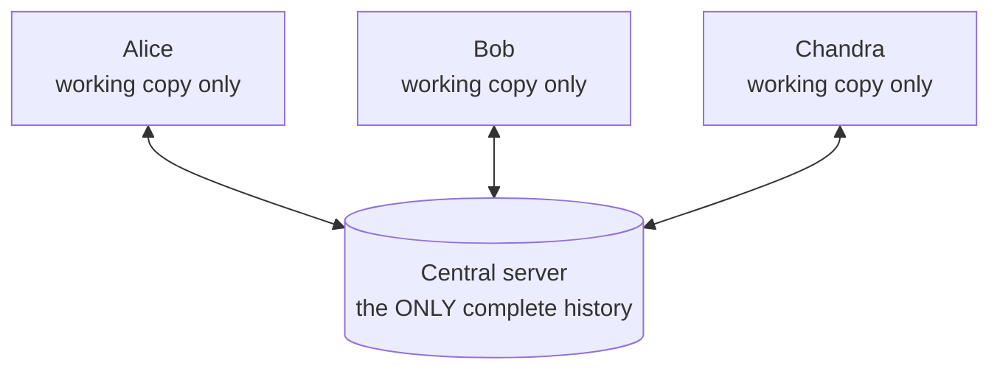
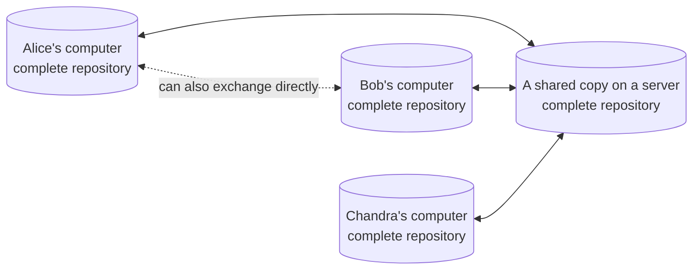

# Chapter 11 — Centralised vs Distributed [Core]

**In this chapter**

- the two designs of version-control system, drawn and compared
- the word *repository*, introduced informally
- why Git's design lets you work on a train, and what it costs
- how to choose between the designs, without declaring one the winner

**Before you start.** Chapter 9<!--ref:problem--> (the eight requirements) and Chapter 5<!--ref:internet--> (client, server, local, remote). Chapter 10<!--ref:history--> is not required, though it explains how the two designs arose.

---

## 11.1 The word "repository"

Before the two designs can be described, one word is needed.

> **New term: repository.** The place where a project's files *and the complete record of their history* are kept.

Think of a repository as a project folder that has a memory. In a Git project the repository is the folder itself plus a hidden `.git` folder inside it (Chapter 2<!--ref:files--> said that hidden folder was coming). Chapter 15<!--ref:model--> gives the exact definition; for now, "repository" means "the project and its history, kept together".

You will also hear the shorthand **repo**.

---

## 11.2 Design one: centralised

In a **centralised** system there is one repository, held on a server. Everyone else holds only a *working copy*: the files of one version, with no history.

> **New term: centralised version control.** A design in which one central server holds the only complete history, and each user holds only a working copy of the files and a connection to the server.

*Diagram description:* a database symbol in the centre represents the central server that holds the complete history. Three people, Alice, Bob and Chandra, are each connected to it by a two-way arrow. Each holds only a working copy of the files.

How it feels to use: to see who changed a line last year, you ask the server. To record your work, you send it to the server. If you cannot reach the server, you cannot do either.

**Strengths.** There is one official history and one place to look. Administration and access control are simple to reason about, because everything passes through one door. The size of a working copy is small, because it holds one version and not all of them.

**Weaknesses.**

- **A single point of failure.** If the server is unreachable, nobody can record work or read history. If it is lost without a backup, the history is lost.
- **Needs the network for almost everything.**
- **Sharing half-finished work is awkward**, because the only way to share is to send it to the one official place.

> **New term: single point of failure.** A part of a system whose failure stops the whole system, or destroys something that cannot be replaced.

---

## 11.3 Design two: distributed

In a **distributed** system, every user holds a full repository, with the complete history, on their own computer.

> **New term: distributed version control.** A design in which every user holds a complete copy of the repository, including its whole history, so that most actions need no server and any copy can exchange history with any other.

*Diagram description:* four database symbols represent four complete repositories, Alice's, Bob's, Chandra's and a shared one on a server. Alice, Bob and Chandra each have a two-way link to the shared server copy. A dotted line shows that Alice and Bob could also exchange history directly with each other.

The word **clone** describes how you get your own full copy.

> **New term: clone.** A complete copy of a repository, with all of its history, made on another computer.

How it feels to use: to see history, you look at your own computer. To record your work, you record it on your own computer. To share, you *exchange* history with another copy, and this needs a network only at that moment. If the shared server vanishes, every person still has a complete copy, and any one of them can become the new shared copy.

The "shared copy on a server" in the diagram is a convention, not a requirement of the design. Nothing in the design *forces* a central point; teams choose one because a well-known meeting place is convenient. That is exactly the role that GitHub plays in Part V, and Chapter 12<!--ref:platforms--> separates the tool from the platform.

**Strengths.**

- **Fast**, because most actions are local.
- **Works offline.** Record your work on a train and share it later.
- **Resilient.** Every copy is a backup of the history.
- **Cheap experiments.** You can try an idea in private, without anyone seeing half-finished work.

**Weaknesses.**

- **A bigger copy on every computer**, because the whole history is stored locally. Very large histories can be heavy (Chapter 31<!--ref:bigrepos--> addresses this).
- **More concepts to learn.** There are two levels of "recording" (locally, then sharing), which is the main cost of learning Git.
- **No single authority is built in.** A team must *agree* which copy is the official one and how changes reach it. Chapter 34<!--ref:workflows--> is about exactly that.

---

## 11.4 Side by side

| Question | Centralised | Distributed |
|---|---|---|
| Where is the complete history? | On the server only | On every computer |
| Can I read history offline? | No | Yes |
| Can I record my work offline? | No | Yes |
| What if the server is lost? | The history may be lost | Every copy remains a full backup |
| How big is my copy? | One version | The whole history |
| Where do I try a private experiment? | Awkward | On my own computer |
| Is there an official copy? | Yes, by design | By agreement of the team |
| Main learning cost | Fewer concepts | Local vs shared history |

> **Verification pending [R139].** These are properties of the *designs*. Statements about how particular products (Subversion-style systems on one side, Git and similar tools on the other) behave in practice have not yet been checked against their documentation, and are not made here.

---

## 11.5 Git versus Subversion-style systems

A common exam question, and a real decision: "Should we use Git or a centralised system such as Subversion?" Because the two are built on different designs, the honest answer is a comparison, not a verdict.

**Choose a distributed tool such as Git when** people work in parallel on a project, work from different places or with intermittent networks, want private experiments, or contribute from outside the organization.

**A centralised tool may suit you when** a team is small and always connected, a single official history with strict central control matters more than flexibility, or a project's large binary files make copying the whole history to everyone impractical, and its tooling handles them better. (These are judgements to weigh, not rules; check current documentation when you decide.)

**The practical fact** for most learners is that Git dominates the settings in which they will work, so learning Git is a safe investment (Chapter 10<!--ref:history-->).

---

## 11.6 A common confusion: distributed does not mean "no server"

Beginners hear "distributed" and picture a project with no shared place. That is not what teams do. Nearly every team using Git chooses **one shared repository** as the meeting point. The difference from the centralised design is that this shared copy is *a convention*: it is a copy like any other, it holds nothing that your own copy lacks, and you can work for weeks without touching it.

Another way to say it: in a centralised system the server is *the* repository; in a distributed system it is *a* repository that the team treats as the official one.

---

## 11.7 What a later chapter will let you prove

Chapter 23<!--ref:remotes--> opens with an experiment that needs no account and no internet: it creates two complete repositories on your own computer and exchanges history between them. Seeing history move from one complete copy to another is the best way to understand what "distributed" means. That is why the experiment comes before you ever meet GitHub.

---

## Checkpoint

## What You Learned

- A repository is a project together with the complete record of its history.
- In a centralised design one server holds the only history and users hold working copies; it has one official source but a single point of failure and needs the network for almost everything.
- In a distributed design every user holds the complete history; most actions are local and fast, and it works offline, at the cost of a larger copy, more concepts, and a team's need to agree on the official copy.
- "Distributed" does not mean "no shared server": teams usually choose one shared repository by convention.
- The choice between designs depends on the team and the project; Git suits most parallel, varied-network work.

## New Vocabulary

- **Repository**: a project together with the complete record of its history.
- **Centralised version control**: one server holds the only complete history; users hold working copies.
- **Distributed version control**: every user holds a complete copy of the repository.
- **Clone**: a complete copy of a repository, with its history, made on another computer.
- **Single point of failure**: a part whose failure stops the whole system or loses something irreplaceable.

## Commands Learned

None.

## Common Mistakes

1. **Thinking "distributed" means there is no shared copy.**
2. **Assuming your local copy is only a snapshot.** It holds the whole history.
3. **Treating the shared copy as special.** It is a repository like yours.
4. **Choosing a tool by popularity alone.** Weigh the team, the project and the network.

## Practice

Do the exercises in [`exercises/ch11-exercises.md`](../../../exercises/ch11-exercises.md).

## Self-Test

1. What does a repository contain besides the project's files?
2. Why is a central server a single point of failure?
3. In a distributed system, what do you do when the network is down?
4. Give one strength and one cost of the distributed design.
5. Why does a distributed team still usually choose a shared repository?

## Before Moving On

You are ready for Chapter 12<!--ref:platforms--> if you can:

- [ ] draw both designs from memory
- [ ] explain what "the whole history on my computer" makes possible
- [ ] say why "distributed" does not mean "no shared repository"
- [ ] state one situation in which a centralised design might still be chosen

## How this chapter was checked

| Claim | Evidence class | Ledger |
|---|---|---|
| Definitions and trade-offs of the two designs | Needs re-verification (design-level statements; no product behaviour is claimed) | R139 |

## Where this leads

Chapter 12<!--ref:platforms--> separates the Git tool from hosting platforms. Chapter 15<!--ref:model--> gives Git's exact vocabulary for what a repository contains. Chapter 23<!--ref:remotes--> proves the distributed idea with two repositories on your own computer.
