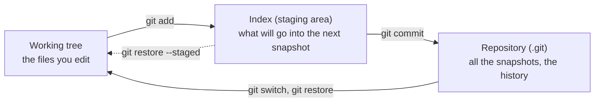
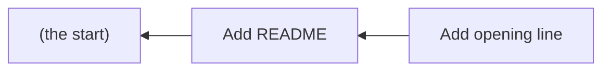
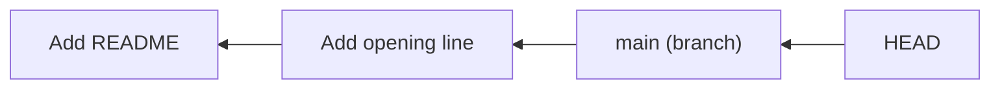
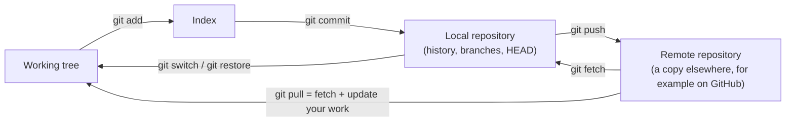

# Chapter 15 — Git's Core Model [Core]

**In this chapter**

- the five ideas on which every Git command rests: the working tree, the index, the repository, the commit, and the pointers HEAD and branch
- a picture of how they fit together, which you will use for the rest of the book
- the four states a file can be in, and how `git status` reports each one
- a look at what Git really stores, with real output, so that nothing is magic

**Before you start.** Chapter 9<!--ref:problem--> (why version control exists), Chapter 11<!--ref:distributed--> (the repository as a project with its history), and Chapter 14<!--ref:config--> (you have a name and email set). You will type commands in this chapter; every recording was run for real.

This chapter is the most important one in Part III. Take your time, and come back to its pictures whenever a later chapter feels confusing. Almost every Git surprise is a misunderstanding of one of the ideas here.

---

## 15.1 Snapshots

Chapter 9<!--ref:problem--> asked for a system that remembers every version of a project. Git's answer is simple to state: **each time you record your work, Git stores a complete snapshot of the project as it is at that moment**, together with a note saying who recorded it, when and why.

> **New term: snapshot.** A complete picture of all the files of a project at one moment.

You can think of a photograph album. Each photograph is the whole scene at one instant; you can flip back to any of them. (Behind the scenes Git stores snapshots very efficiently, so the album does not grow as fast as this picture suggests. Chapter 30<!--ref:objects--> shows how.)

Everything else in this chapter answers three questions. **Where do I edit?** **How do I choose what goes into the next snapshot?** **Where do the snapshots live?**

---

## 15.2 Three places

Git's model has three places, and the first thing to learn is to keep them apart.



*Diagram description:* three boxes in a row. On the left, the working tree, the files you edit. In the middle, the index, or staging area. On the right, the repository. An arrow labelled `git add` runs from the working tree to the index. An arrow labelled `git commit` runs from the index to the repository. An arrow labelled `git switch, git restore` runs from the repository back to the working tree. A dotted arrow labelled `git restore --staged` runs from the index back towards the working tree.

### 15.2.1 The working tree

> **New term: working tree.** The folder of files you actually see and edit: your project as it is now, including changes not yet recorded.

It is an ordinary folder. Your editor opens files from it; your browser opens `index.html` from it. Git does not stop you from changing anything in it.

### 15.2.2 The index (staging area)

> **New term: index (staging area).** A holding area that lists exactly what will go into the *next* snapshot. Its formal name is the *index*; most people call it the *staging area*, and this book uses both.

The index is what makes Git flexible. You may have edited five files, but only two belong in the change you are about to record. You **stage** those two (`git add`), leaving the others out, and the commit contains only what is staged. Think of packing a parcel: the working tree is the room full of things, the index is the box you are filling, and the commit is the sealed and labelled parcel.

> **New term: stage.** To add a file's current contents to the index, so that they will be included in the next commit.

### 15.2.3 The repository

> **New term: local repository.** The complete history of the project, kept on your computer in a hidden folder called `.git` inside the project folder.

The **repository** holds the snapshots. `.git` is created by `git init` (Chapter 16<!--ref:firstrepo-->). If you delete the `.git` folder, the project folder is left, but its history is gone, so never modify `.git` by hand.

**The rule of thumb:** *edit in the working tree, stage into the index, commit into the repository.*

---

## 15.3 Watching the three places

The recording below builds a project from nothing and runs `git status` at each step. `git status` is the command that tells you which files are in which place. Read each report in turn. (The commands are explained one by one in Chapter 16<!--ref:firstrepo-->; for now, follow what the reports say.)

```text
$ git config --global user.name "Ada Learner"
$ git config --global user.email "ada@example.org"
$ git init -b main model-demo
Initialized empty Git repository in /home/learner/model-demo/.git/
$ cd model-demo
$ git status
On branch main

No commits yet

nothing to commit (create/copy files and use "git add" to track)
```

*Recorded in Bash; `ch15-model/expected-model.bash.txt`.*

A new, empty repository. `No commits yet` means the repository has no history, and `nothing to commit` means there is nothing new in the working tree.

Now a file appears in the working tree:

```text
$ echo "Sunrise Bakery" > README.md
$ git status
On branch main

No commits yet

Untracked files:
  (use "git add <file>..." to include in what will be committed)
	README.md

nothing added to commit but untracked files present (use "git add" to track)
```

*Recorded in Bash; `ch15-model/expected-model.bash.txt`.*

`README.md` is **untracked**: it exists in the working tree, but Git has never been told to include it in a snapshot. Git says so, and suggests the next step, `git add`.

Now stage it, and record it:

```text
$ git add README.md
$ git status
On branch main

No commits yet

Changes to be committed:
  (use "git rm --cached <file>..." to unstage)
	new file:   README.md

$ git commit -m "Add README"
[main (root-commit) 9b522e5] Add README
 1 file changed, 1 insertion(+)
 create mode 100644 README.md
$ git status
On branch main
nothing to commit, working tree clean
```

*Recorded in Bash; `ch15-model/expected-model.bash.txt`.*

After `git add`, the report changed to `Changes to be committed: new file: README.md`. That is the staging area speaking: the file is in the index, ready for the next commit. After `git commit`, the working tree is `clean`: everything in the working tree matches the last snapshot, and nothing is staged.

Next, a change to a file that Git already knows:

```text
$ echo "Fresh bread every morning." >> README.md
$ git status
On branch main
Changes not staged for commit:
  (use "git add <file>..." to update what will be committed)
  (use "git restore <file>..." to discard changes in working directory)
	modified:   README.md

no changes added to commit (use "git add" and/or "git commit -a")
$ git add README.md
$ git status
On branch main
Changes to be committed:
  (use "git restore --staged <file>..." to unstage)
	modified:   README.md

$ git commit -m "Add opening line"
[main c3c1c38] Add opening line
 1 file changed, 1 insertion(+)
```

*Recorded in Bash; `ch15-model/expected-model.bash.txt`.*

Read the first report: `Changes not staged for commit ... modified: README.md`. The file changed in the working tree, but the change has not been staged, so a commit now would *not* include it. After `git add`, the report says `Changes to be committed ... modified: README.md`: the change is staged. The commit then recorded it.

### 15.3.1 The four states of a file

That walk-through showed every state a file can be in. Learn them as a set.

| State | Meaning | `git status` says | Where the change is |
|---|---|---|---|
| **Untracked** | Git has never been told about this file | `Untracked files` | Working tree only |
| **Modified** | A file Git tracks has changed since the last commit | `Changes not staged for commit` | Working tree |
| **Staged** | The change is in the index, ready to be committed | `Changes to be committed` | Index (and working tree) |
| **Committed** | The change is in a snapshot in the repository | `nothing to commit, working tree clean` | Repository |

> **New term: tracked file.** A file that Git knows about, because it is in the last commit or in the index.

> **Note on wording (R154).** The status messages above were recorded on Git 2.43.0 and re-run in CI on Git 2.55.0, where they were identical. The wording is Git's own and can change between versions, which is why the book shows recorded output and not descriptions of it.

---

## 15.4 The commit

> **New term: commit.** A recorded snapshot of the project, together with a note about who made it, when, and why, and a link to the commit that came before it. Also the action of creating one.

A commit is the unit of history. Each commit has:

1. **A snapshot** of all tracked files as staged.
2. **An author and a committer**, with name, email and a time.
3. **A message**, in the author's words, saying why.
4. **A parent**: the commit that came immediately before it (the first commit has none).
5. **An identifier**: a long code, called a hash, that names this commit and no other.

> **New term: hash (commit identifier).** A long string of letters and digits, computed by Git from the commit's contents, that identifies it uniquely. It is usually shown shortened to its first seven characters.

The log of the demonstration project shows two commits:

```text
$ git log --oneline
c3c1c38 (HEAD -> main) Add opening line
9b522e5 Add README
```

*Recorded in Bash; `ch15-model/expected-model.bash.txt`.*

You can look inside the newest one. The next recording asks Git for the *type* of what `HEAD` names (a commit) and then prints its raw contents:

```text
$ git cat-file -t HEAD
commit
$ git cat-file -p HEAD
tree 2152ed97942876843c1435fe8f6159d07b509541
parent 9b522e59f1a9c908f07b62485b3f13af75a0def2
author Ada Learner <ada@example.org> 1767604380 +0000
committer Ada Learner <ada@example.org> 1767604380 +0000

Add opening line
```

*Recorded in Bash; `ch15-model/expected-model.bash.txt`.*

Read the output of `git cat-file -p HEAD`:

- `tree 2152ed9...` is the **snapshot**: a pointer to the stored picture of the whole project.
- `parent 9b522e5...` is the **previous commit** (the first one from the log above).
- `author` and `committer` record who, and when. (The number is the time in seconds since the start of 1970; Git prints it in this raw form here.)
- The last line is the **message**.

Because each commit names its parent, commits form a **chain**, and the chain is the history:



*Diagram description:* two commits in a row. The newer one, "Add opening line", points back to its parent, "Add README", which points back to the start of history. Arrows run from newer to older.

**Why the hash matters.** The hash is calculated from everything in the commit, *including its parent's hash*. Change anything in an old commit and its hash changes, and so does every later commit's. That is how Git notices tampering: history cannot be altered without leaving a different chain (Chapter 30<!--ref:objects--> explains it fully).

> **Checked against the documentation (R152).** Git's glossary (Git 2.56.0) defines a commit as "a single point in the Git history", and, as a verb, "the action of storing a new snapshot of the project's state in the Git history, by creating a new commit representing the current state of the index and advancing HEAD to point at the new commit". A commit object "contains the information about a particular revision, such as parents, committer, author, date and the tree object which corresponds to the top directory of the stored revision". The index is "a stored version of your working tree"; the working tree is "the tree of actual checked out files", normally containing "the contents of the HEAD commit's tree, plus any local changes that you have made but not yet committed". Hash chaining is explained in Chapter 30<!--ref:objects--> with its own evidence.

---

## 15.5 Pointers: HEAD and branches

A history of connected commits needs a way to say *where you are* and *what the latest commit of a line of work is*. Git uses two kinds of pointer.

> **New term: branch.** A movable name that points to a commit, and, by extension, to that commit's whole chain of history. The default branch of a new repository is often called `main`.

> **New term: HEAD.** A pointer that says which commit you are currently looking at and working on. Usually it points to a branch, which points to a commit.

Both are simple enough to display. The recording continues:

```text
$ ls -a
.  ..  .git  README.md
$ cat .git/HEAD
ref: refs/heads/main
$ cat .git/refs/heads/main
c3c1c387782f6bea6232038b7469106e47b543e0
```

*Recorded in Bash; `ch15-model/expected-model.bash.txt`.*

Read those three commands:

1. `ls -a` shows the hidden `.git` folder beside `README.md` (Chapter 2<!--ref:files-->).
2. `cat .git/HEAD` prints `ref: refs/heads/main`. HEAD **points to the branch `main`**.
3. `cat .git/refs/heads/main` prints a long code. That is the **hash of the latest commit**: the branch `main` is nothing more than a small file that holds one commit's hash.

That is the whole secret of branches: **a branch is a name for a commit**. When you make a new commit, Git creates it with the current commit as its parent and moves the branch name forward to it. Creating a branch (Chapter 20<!--ref:branching-->) costs almost nothing, because it is only a new name pointing at an existing commit. This is why Git's branches are cheap, the point made in Chapter 10<!--ref:history-->.



*Diagram description:* HEAD points to the branch name `main`; `main` points to the newest commit, "Add opening line"; that commit points to its parent, "Add README".

### 15.5.1 Other pointers, met later

| Pointer | What it is | Chapter |
|---|---|---|
| **Tag** | A name that is *fixed* to one commit, used to mark a version such as "v1.0" | Chapter 29<!--ref:tags--> |
| **Remote** | A name (often `origin`) for another repository you share history with | Chapter 23<!--ref:remotes--> |
| **Remote-tracking branch** | Your local note of where a branch on a remote was the last time you checked, for example `origin/main` | Chapter 23<!--ref:remotes--> |

You need not remember them now. The point is that **every one of these is a name for a commit**, and the commits themselves are the history.

---

## 15.6 The index, recorded

One more recording shows the index directly:

```text
$ git ls-files --stage
100644 cb7b0f73c5bafa598e86f818ac65939bbf51a2f8 0	README.md
```

*Recorded in Bash; `ch15-model/expected-model.bash.txt`.*

`git ls-files --stage` lists what is in the index: the file's **mode** (`100644` means an ordinary file), the identifier of its stored **contents**, a stage number (`0` is normal; it becomes non-zero only during a conflict, Chapter 22<!--ref:conflicts-->), and the file's path. After a commit, the index matches the last snapshot, which is why `git status` reports it as clean.

---

## 15.7 The whole picture

Put the pieces together, including the parts you will meet in Chapter 23<!--ref:remotes-->:



*Diagram description:* the working tree feeds the index with `git add`; the index feeds the local repository with `git commit`; the local repository sends history to a remote with `git push`; the remote sends history back into the local repository with `git fetch`; `git switch` and `git restore` move files from the local repository into the working tree; `git pull` combines a fetch with updating your work.

If you can reproduce this diagram from memory and say what each arrow does, you understand Git's model. Chapters 16<!--ref:firstrepo--> to 23<!--ref:remotes--> teach one arrow at a time.

---

## Checkpoint

## What You Learned

- Git records **snapshots** of a project; a commit is a snapshot plus author, time, message and a link to its parent.
- Three places matter: the **working tree** (where you edit), the **index** (what will be committed) and the **repository** (the history in `.git`).
- A file is untracked, modified, staged or committed; `git status` reports which.
- Commits form a chain through their parents; a hash identifies each commit and depends on its content.
- A **branch** is a name for a commit, and **HEAD** says where you are; both are tiny pointers.
- Tags, remotes and remote-tracking branches are also names, met later.

## New Vocabulary

- **Snapshot**: a complete picture of all the files of a project at one moment.
- **Working tree**: the folder of files you see and edit.
- **Index (staging area)**: the holding area that lists what the next commit will contain.
- **Stage**: to add a file's current contents to the index.
- **Local repository**: the complete history, kept in the hidden `.git` folder.
- **Tracked file**: a file that is in the last commit or in the index.
- **Commit**: a recorded snapshot plus author, time, message and parent; also the action of making one.
- **Hash (commit identifier)**: the long code that uniquely identifies a commit.
- **Branch**: a movable name that points to a commit.
- **HEAD**: the pointer saying which commit you are currently on.

## Commands Learned

`git status`, `git add`, `git commit -m`, `git log --oneline`, `git ls-files --stage`, `git cat-file -t`, `git cat-file -p`. (You read the output of most of these; Chapter 16<!--ref:firstrepo--> teaches you to use them.)

## Common Mistakes

1. **Believing that saving a file records it in Git.** Saving changes the working tree only.
2. **Forgetting to stage a change** and expecting it in the commit.
3. **Thinking the index is the same as the last commit.** It is what will go into the *next* one.
4. **Deleting `.git` "to clean up".** That deletes the history.
5. **Thinking a branch is a copy of the project.** It is a name for a commit.

## Practice

Do the exercises in [`exercises/ch15-exercises.md`](../../../exercises/ch15-exercises.md).

## Self-Test

1. Name the three places and say what lives in each.
2. A file is edited and saved but not staged. Which state is it in, and what does `git status` say?
3. What are the five parts of a commit?
4. What is a branch, really? What does `.git/refs/heads/main` contain?
5. What does HEAD point to, usually?
6. Why does changing an old commit change all later hashes?

## Before Moving On

You are ready for Chapter 16<!--ref:firstrepo--> if you can:

- [ ] draw the three places and the arrows between them from memory
- [ ] classify a file as untracked, modified, staged or committed from a `git status` report
- [ ] explain "a branch is a name for a commit"
- [ ] say where the history is stored and why not to edit it by hand

## How this chapter was checked

| Claim | Evidence class | Ledger |
|---|---|---|
| The status reports at each stage, the four file states, `git ls-files --stage` | Locally tested: Bash 5.2 and zsh 5.9 on Git 2.43.0; re-run in CI on the runner's Git 2.55.0 with identical output. Some concept and option statements for this row were also checked in the Git 2.56.0 manual (git-status); the ledger row says which. | R154 |
| A commit has a tree, a parent, author, committer and message | Locally tested (`git cat-file -p HEAD`) | R152 |
| HEAD contains `ref: refs/heads/main`; the branch file holds a commit hash | Locally tested. Some concept and option statements for this row were also checked in the Git 2.56.0 manual (gitrepository-layout); the ledger row says which. | R153 |
| The conceptual definitions (snapshot, working tree, index) | Compared with the Git 2.56.0 glossary (commit, commit object, index, working tree) | R152 |

## Where this leads

Chapter 16<!--ref:firstrepo--> uses these ideas to create a repository and record your first versions. Chapter 17<!--ref:history_view--> reads history and compares versions. Chapter 20<!--ref:branching--> creates and switches branches, and Chapter 30<!--ref:objects--> looks inside `.git` to see how snapshots and hashes are really stored.
