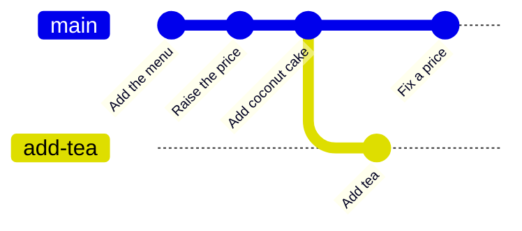

# Chapter 20 — Branching [Core]

**In this chapter**

- why branches exist and what problem they solve
- listing, creating, switching, renaming and deleting branches
- what happens to your files when you switch, including the two ways switching can go wrong
- the older `git checkout` and how it relates to `git switch`
- detached HEAD: the state you will meet, and how to leave it
- branch names and how branches are used in teams

**Before you start.** Chapter 15<!--ref:model--> (a branch is a name for a commit, `HEAD` says where you are), Chapter 17<!--ref:history_view--> (`git log`) and Chapter 19<!--ref:commits--> (good commits). The recordings use the `bakery-menu` repository with its three commits.

Every recording was run in Bash and zsh on Git 2.43.0 and re-run in CI on Git 2.55.0 (the two outputs were identical, except for one hint, recorded twice).

---

## 20.1 The problem branches solve

The bakery wants to try a new idea: adding tea to the menu. Meanwhile the current menu, the one customers see, must stay correct: someone might still need to fix a price. You want **two lines of work at once**: the stable menu, and the experiment.

Without branches you would copy the whole folder (Chapter 9<!--ref:problem-->) and struggle to combine the two later. Git's answer is the **branch**.

> **Reminder.** A branch is a movable name that points to a commit (Chapter 15<!--ref:model-->). Because it is only a name, creating one costs almost nothing, and you can create as many as you like.



*Diagram description:* three commits in a line on the branch `main`. From the third commit a second line, called `add-tea`, splits off and gets one commit, "Add tea". Meanwhile `main` also gets a new commit, "Fix a price". The two lines now differ, and each can go on growing independently.

Branches let people (and one person at different times) work in parallel without disturbing each other, and they make **experiments safe**: if the tea idea is bad, delete the branch and `main` never noticed.

---

## 20.2 Seeing the branches

> **New term: git branch.** Lists, creates, renames and deletes branches.

Start in the repository:

```text
$ cd bakery-menu
$ git branch
* main
```

*Recorded in Bash; `ch20-branching/expected-branches.bash.txt`.*

`git branch` with no argument **lists** the branches. The asterisk `*` marks the **current** branch, the one `HEAD` points to. There is only `main` so far. To print only the current branch's name, use `git branch --show-current`.

---

## 20.3 Creating a branch

```text
$ git branch add-tea
$ git branch
  add-tea
* main
```

*Recorded in Bash; `ch20-branching/expected-branches.bash.txt`.*

`git branch add-tea` **created** the branch but did **not switch to it**: the asterisk is still on `main`. The new branch points to the same commit as `main`: that is the whole cost of a new branch, one new name.

---

## 20.4 Switching branches

> **New term: git switch.** Changes the current branch: it moves `HEAD` to another branch and updates the working tree to match.

```text
$ git switch add-tea
Switched to branch 'add-tea'
$ git branch
* add-tea
  main
```

*Recorded in Bash; `ch20-branching/expected-branches.bash.txt`.*

`git switch add-tea` moved `HEAD` to the branch `add-tea`. The asterisk moved with it. No files changed yet, since the two branches point to the same commit.

> **Checked against the documentation (R169).** In Git's own documentation, `git switch` and `git restore` were marked "THIS COMMAND IS EXPERIMENTAL. THE BEHAVIOR MAY CHANGE." up to and including Git 2.50.0. The release notes of **Git 2.51.0** say that both commands "are declared to be no longer experimental", and the manual pages of 2.51.0 and later no longer carry the warning. Older Git versions you may meet still have it, and in every recording in this book the commands behave identically on Git 2.43.0 and 2.55.0.

### 20.4.1 Committing on a branch

Now make a change on `add-tea`, and commit it:

```text
$ printf '# Sunrise Bakery menu\n\n- White loaf: 2.80\n- Rolls (six): 3.00\n- Coconut cake (slice): 4.00\n- Tea: 1.50\n' > menu.md
$ git commit -am "Add tea to the menu"
[add-tea 5a16424] Add tea to the menu
 1 file changed, 1 insertion(+)
```

*Recorded in Bash; `ch20-branching/expected-branches.bash.txt`.*

The commit was recorded on `add-tea`: notice `[add-tea 5a16424]` in the output. The graph view shows what happened to the history:

```text
$ git log --oneline --all --graph
* 5a16424 (HEAD -> add-tea) Add tea to the menu
* 81f772e (main) Add coconut cake
* 9f10b43 Raise the price of the white loaf
* 8a52ffe Add the menu
```

*Recorded in Bash; `ch20-branching/expected-branches.bash.txt`.*

Read the graph, newest at the top:

- `*` marks each commit; the vertical line joins each to its parent.
- `(HEAD -> add-tea)` says that `HEAD` is on `add-tea`, which points to the newest commit, "Add tea to the menu".
- `(main)` marks the commit that `main` still points to: "Add coconut cake". The branch `main` did **not** move when you committed on `add-tea`.

The options: `--oneline` (one line per commit), `--all` (show *all* branches, not only the current one) and `--graph` (draw the lines). You will use this combination throughout the rest of Part III.

### 20.4.2 What switching does to your files

A branch is a different **version of the whole project**, so switching changes the files in your working tree. Watch the file `menu.md` as the branch changes:

```text
$ git switch main
Switched to branch 'main'
$ cat menu.md
# Sunrise Bakery menu

- White loaf: 2.80
- Rolls (six): 3.00
- Coconut cake (slice): 4.00
$ git switch add-tea
Switched to branch 'add-tea'
$ cat menu.md
# Sunrise Bakery menu

- White loaf: 2.80
- Rolls (six): 3.00
- Coconut cake (slice): 4.00
- Tea: 1.50
```

*Recorded in Bash; `ch20-branching/expected-branches.bash.txt`.*

On `main`, `menu.md` has no tea. On `add-tea`, it has the tea line. Git rewrote the file when you switched. Nothing was lost; each version is safe in its branch. This is the moment that Chapter 15<!--ref:model--> promised: **the working tree is whatever the current branch says it should be.**

---

## 20.5 Creating and switching in one step

You nearly always want to create a branch *and* start working on it. `git switch -c` does both (`-c` stands for *create*):

```text
$ git switch main
Switched to branch 'main'
$ git switch -c fix-typo
Switched to a new branch 'fix-typo'
```

*Recorded in Bash; `ch20-branching/expected-branches.bash.txt`.*

`git branch -vv` shows more detail per branch: the branch name, the commit it points to and that commit's message:

```text
$ git branch -vv
  add-tea  5a16424 Add tea to the menu
* fix-typo 81f772e Add coconut cake
  main     81f772e Add coconut cake
```

*Recorded in Bash; `ch20-branching/expected-branches.bash.txt`.*

The new branch `fix-typo` points to the same commit as `main` (`81f772e`). The other, `add-tea`, points to its own newer commit.

---

## 20.6 Renaming and deleting

**Rename** a branch with `git branch -m old new`:

```text
$ git branch -m fix-typo tidy-menu
$ git branch
  add-tea
  main
* tidy-menu
```

*Recorded in Bash; `ch20-branching/expected-branches.bash.txt`.*

**Delete** one with `git branch -d`. Git protects you: it refuses to delete the branch you are standing on, and it refuses to delete a branch whose work has **not been merged**:

```text
$ git branch -d tidy-menu
error: cannot delete branch 'tidy-menu' used by worktree at '/home/learner/bakery-menu'
$ git switch main
Switched to branch 'main'
$ git branch -d tidy-menu
Deleted branch tidy-menu (was 81f772e).
$ git branch -d add-tea
error: the branch 'add-tea' is not fully merged.
If you are sure you want to delete it, run 'git branch -D add-tea'
$ git branch -D add-tea
Deleted branch add-tea (was 5a16424).
```

*Recorded in Bash; `ch20-branching/expected-branches.bash.txt`.*

Read each step:

1. `git branch -d tidy-menu` failed: you cannot delete the branch you are on. Switch away first.
2. After `git switch main`, the same command succeeded: `tidy-menu` had no commits of its own (it pointed to the same commit as `main`), so nothing would be lost.
3. `git branch -d add-tea` **refused**: `add-tea` has a commit that is not in any other branch. Deleting it would leave that commit unreachable (a common way to lose work). The message tells you the forceful alternative.
4. `git branch -D add-tea` (capital `D`) **forced** the deletion. Git printed the commit it had pointed to: `5a16424`. The commit was not destroyed at once, but nothing points to it any more, so it is hard to find. (Chapter 26<!--ref:reflog--> shows how to get it back.)

> **⚠️ CAUTION.** `git branch -D` deletes a branch **even if it has unmerged work**. Use it only when you are certain that you no longer need that work, and note the hash it prints so that you can recover it (Chapter 26<!--ref:reflog-->).

*On the newer Git (2.55.0) the refusal in step 3 is worded slightly differently:*

```text
$ git branch -d add-tea
error: the branch 'add-tea' is not fully merged
hint: If you are sure you want to delete it, run 'git branch -D add-tea'
hint: Disable this message with "git config set advice.forceDeleteBranch false"
```

*Recorded in Bash; `ch20-branching/expected-branches.bash.alt.txt`.*

*The newer message adds a `hint:` line, and tells you how to switch the hint off. The meaning is the same.*

---

## 20.7 Switching when you have uncommitted changes

Changes that you have not committed live in the working tree (and, if staged, in the index). They are not part of any branch. So what happens to them when you switch? Two cases, both recorded.

### 20.7.1 The changes do not clash: Git carries them along

The recording stages a new file, `hours.md`, on `main`, and switches to `add-tea`:

```text
$ printf 'Open Monday to Saturday.\n' > hours.md
$ git add hours.md
$ git switch add-tea
A	hours.md
Switched to branch 'add-tea'
$ git status --short
A  hours.md
```

*Recorded in Bash; `ch20-branching/expected-dirty.bash.txt`.*

Git switched, and **took the staged change with it**: `A  hours.md` (staged as a new file) is now on `add-tea`. The line `A	hours.md` printed by `git switch` is Git telling you that the change came with you. This is convenient, and a surprise if you did not expect it: the uncommitted change now belongs to whichever branch you are on when you eventually commit.

### 20.7.2 The changes clash: Git refuses

Now `main` and `add-tea` have *different* contents of `menu.md`, and the learner changes `menu.md` (uncommitted) on `main`, then tries to switch:

```text
$ git switch main
A	hours.md
Switched to branch 'main'
$ printf '# Sunrise Bakery menu\n\n- White loaf: 3.00\n- Rolls (six): 3.00\n- Coconut cake (slice): 4.00\n' > menu.md
$ git switch add-tea
error: Your local changes to the following files would be overwritten by checkout:
	menu.md
Please commit your changes or stash them before you switch branches.
Aborting
$ git status --short
A  hours.md
 M menu.md
```

*Recorded in Bash; `ch20-branching/expected-dirty.bash.txt`.*

Git **refused**, with a clear message: `Your local changes to the following files would be overwritten by checkout: menu.md`. Switching would have had to overwrite the uncommitted edit. It offers two ways out: **commit** the changes, or **stash** them.

### 20.7.3 Stashing

```text
$ git stash
Saved working directory and index state WIP on main: 81f772e Add coconut cake
$ git switch add-tea
Switched to branch 'add-tea'
$ git stash pop
Auto-merging menu.md
On branch add-tea
Changes to be committed:
  (use "git restore --staged <file>..." to unstage)
	new file:   hours.md

Changes not staged for commit:
  (use "git add <file>..." to update what will be committed)
  (use "git restore <file>..." to discard changes in working directory)
	modified:   menu.md

Dropped refs/stash@{0} (7ad1cd045fd28554d6d12eecf6fb3dae681bff32)
```

*Recorded in Bash; `ch20-branching/expected-dirty.bash.txt`.*

`git stash` set the uncommitted changes aside (Chapter 24<!--ref:stash--> covers it fully), which made the working tree clean, so `git switch add-tea` succeeded. `git stash pop` then re-applied the saved changes on the new branch (`Auto-merging menu.md`), and reported the state of the working tree.

**A safe rule:** before you switch branches, run `git status`. If it is clean, switching is safe. If not, commit or stash first, unless you *mean* to carry the change.

---

## 20.8 The older command: `git checkout`

Before `git switch` existed, one command did nearly everything: `git checkout`. It still works, and you will see it in tutorials and scripts.

```text
$ git checkout -b legacy-style
Switched to a new branch 'legacy-style'
$ git branch
* legacy-style
  main
$ git checkout main
Switched to branch 'main'
$ git branch -d legacy-style
Deleted branch legacy-style (was 81f772e).
```

*Recorded in Bash; `ch20-branching/expected-checkout.bash.txt`.*

`git checkout -b legacy-style` created and switched (like `git switch -c`); `git checkout main` switched back (like `git switch main`); and `git branch -d` deleted the merged branch.

Why two commands? `git checkout` grew to do **two unrelated jobs**: switching branches, *and* restoring files from a commit. That made it confusing. Newer Git separates them: `git switch` for branches (this chapter) and `git restore` for files (Chapter 25<!--ref:undo-->). This book teaches the new commands and points out the old forms where you will meet them.

> **Checked against the documentation (R170).** The release notes of Git 2.23.0 introduce the two commands "to split 'checking out a branch to work on advancing its history' and 'checking out paths out of the index and/or a tree-ish to work on advancing the current history' out of the single `git checkout` command". That is the reason given above, in the project's own words.

If you give `git switch` a name that does not exist, it says so:

```text
$ git switch nowhere
fatal: invalid reference: nowhere
```

*Recorded in Bash; `ch20-branching/expected-checkout.bash.txt`.*

---

## 20.9 Detached HEAD

Normally `HEAD` points to a **branch**, and the branch points to a commit. It is also possible to point `HEAD` **directly at a commit**, with no branch. That state has a name.

> **New term: detached HEAD.** The state in which `HEAD` points directly to a commit instead of to a branch.

You get there when you look at an old commit:

```text
$ git switch --detach HEAD~1
HEAD is now at 9f10b43 Raise the price of the white loaf
$ git status
HEAD detached at 9f10b43
nothing to commit, working tree clean
$ git switch main
Previous HEAD position was 9f10b43 Raise the price of the white loaf
Switched to branch 'main'
```

*Recorded in Bash; `ch20-branching/expected-checkout.bash.txt`.*

`git switch --detach HEAD~1` moved `HEAD` to the commit before the newest one. `git status` says `HEAD detached at 9f10b43`. You can look around, and even make commits, but **new commits belong to no branch**, so they are easy to lose once you switch away. `git switch main` brought us back; Git also noted `Previous HEAD position was 9f10b43 ...` in case you want to return.

Detached HEAD is not an error, and you do not need to fear it, but you should recognise it. Chapter 26<!--ref:reflog--> explains how to work in it safely and how to rescue commits made there. For now: **if `git status` says "HEAD detached", switch to a branch before you make commits.**

---

## 20.10 Naming branches

Git allows most names, but some are rejected, and some are better than others.

```text
$ git branch feature/add-tea
$ git branch fix-broken-link
$ git branch "bad name"
fatal: 'bad name' is not a valid branch name
$ git branch bad..name
fatal: 'bad..name' is not a valid branch name
$ git branch
  feature/add-tea
  fix-broken-link
* main
$ git branch --show-current
main
```

*Recorded in Bash; `ch20-branching/expected-naming.bash.txt`.*

*Newer Git versions (2.55.0 was tested) print two extra `hint:` lines after each `fatal:` line, pointing to `git help check-ref-format`. The refusal itself is the same.*

Two rejections are recorded: a name with a **space** and a name containing **`..`** are not valid. A name with a slash, `feature/add-tea`, *is* valid. Slashes group branch names (the branches appear as `feature/add-tea`).

**Conventions.** These are habits, not Git rules, and your team may have its own:

- lowercase words joined by hyphens: `fix-broken-link`;
- a **short prefix** that says the kind of work: `feature/`, `fix/`, `docs/`, `hotfix/`;
- a name that says *what the branch is for*, so it still makes sense in a month;
- no spaces, and avoid characters that are special to your shell.

> **Checked against the documentation (R171).** The rules for what Git rejects are in `git check-ref-format` (Git 2.56.0). Among them: a name cannot contain two consecutive dots `..`; ASCII control characters, space, tilde `~`, caret `^` or colon `:`; a question mark `?`, asterisk `*` or open bracket `[`; a backslash; or the sequence `@{`; it cannot begin or end with a slash, end with a dot, or be the single character `@`; and no slash-separated part may begin with a dot or end with `.lock`. The naming conventions above (lowercase, hyphens, prefixes) are habits, not Git rules, and are labelled that way.

---

## 20.11 How teams use branches

You now know the mechanics. Here is the shape of what teams do (Chapter 34<!--ref:workflows--> covers it in detail).

| Kind | Life | Purpose |
|---|---|---|
| **`main`** | Long-lived | The stable, current version of the project |
| **Feature or topic branches** | Short-lived (hours to days) | One piece of work, merged back into `main` when finished |
| **Release or maintenance branches** | Long-lived | Keep older versions fixable |
| **Hotfix branches** | Very short | An urgent repair |

Two guidelines that will save you trouble:

1. **Keep branches short-lived.** The longer a branch lives, the more `main` moves away from it, and the harder it is to bring back (Chapter 22<!--ref:conflicts-->).
2. **Do one thing per branch.** A branch called `add-tea` should contain the tea, not also a redesign of the page.

The next chapter shows how work on a branch is brought back into `main`: merging.

---

## Checkpoint

## What You Learned

- A branch is a name for a commit; branches make parallel work and safe experiments cheap.
- `git branch` lists (current branch starred), creates, renames (`-m`) and deletes (`-d`, `-D`); `git switch` changes branch; `git switch -c` creates and switches.
- `git log --oneline --all --graph` draws the history of all branches.
- Switching changes your working tree to the version on that branch.
- Uncommitted changes that do not clash come along; those that would be overwritten stop the switch (commit or stash).
- `git branch -d` refuses to delete unmerged or current branches; `-D` forces and can lose work.
- `git checkout` is the older command for switching (and restoring files).
- Detached HEAD means `HEAD` points at a commit, not a branch.
- Good branch names are short, lowercase, hyphenated and prefixed by kind.

## New Vocabulary

- **git branch**: lists, creates, renames and deletes branches.
- **git switch**: changes the current branch.
- **Detached HEAD**: the state in which HEAD points directly at a commit.

## Commands Learned

`git branch`, `git branch <name>`, `git branch -vv`, `git branch -m`, `git branch -d`, `git branch -D`, `git branch --show-current`, `git switch`, `git switch -c`, `git switch --detach`, `git checkout`, `git checkout -b`, `git log --oneline --all --graph`.

## Common Mistakes

1. **Forgetting that `git branch <name>` does not switch.**
2. **Committing on the wrong branch.** Check `git branch` (or `git status`) first.
3. **Switching with uncommitted changes** and being surprised that they came along.
4. **Using `git branch -D`** without reading the warning.
5. **Making commits in a detached HEAD**, then switching away.
6. **Leaving branches alive for weeks** until they are hard to merge.

## Practice

Do the exercises in [`exercises/ch20-exercises.md`](../../../exercises/ch20-exercises.md), including Project 4 (part 1).

## Self-Test

1. What is a branch, in one sentence?
2. What is the difference between `git branch add-tea` and `git switch -c add-tea`?
3. You switched from `main` to `add-tea` and `menu.md` changed. Why?
4. Why did `git branch -d add-tea` refuse, and what does `-D` do differently?
5. Your `git switch` was refused with "would be overwritten". Name two ways out.
6. What does "HEAD detached at 9f10b43" mean, and what should you do before making commits?

## Before Moving On

You are ready for Chapter 21<!--ref:merging--> if you can:

- [ ] create a branch, commit on it and see the graph
- [ ] switch between branches and explain why the files change
- [ ] delete a merged branch and explain why `-d` sometimes refuses
- [ ] recognise a detached HEAD and get back to a branch

## How this chapter was checked

| Claim | Evidence class | Ledger |
|---|---|---|
| Listing, creating, switching, `-c`, `-vv`, rename, delete and force-delete; the graph; files change on switch | Locally tested: Bash 5.2 and zsh 5.9, Git 2.43.0; identical on the CI runner's Git 2.55.0 except one hint (both recorded); "experimental" note checked in the Git 2.50.0 and 2.51.0 documentation and release notes | R169 |
| Switching with uncommitted changes (carried; refused; stash) | Locally tested (as above). Some concept and option statements for this row were also checked in the Git 2.56.0 manual (git-switch); the ledger row says which. | R172 |
| `git checkout` equivalents; detached HEAD | Locally tested (as above); reason for the split checked in the Git 2.23.0 release notes | R170 |
| Invalid branch names; naming conventions | Recorded messages: locally tested; rules checked in `git check-ref-format`; conventions: general practice (labelled as such) | R171 |

## Where this leads

Chapter 21<!--ref:merging--> brings a branch's work back into another branch. Chapter 22<!--ref:conflicts--> handles the case in which the two branches changed the same lines. Chapter 24<!--ref:stash--> covers `git stash` fully, and Chapter 26<!--ref:reflog--> shows how to recover a deleted branch or work done in a detached HEAD.
